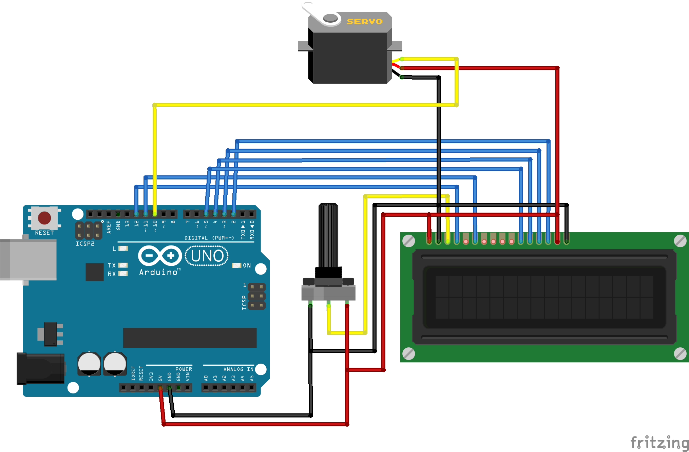

Servo and LCD 2x16
==================

With this example you will display the angle of a servo into a LCD 2x16.
It uses the **Servo**, ``servo.h``, library to control the servo and the **Liquidcrystal**, ``liquidcrystal.h``, library to display the angle on the LCD.

What do we need?
----------------

* One standard servo.

* One display lcd 2x16.

* One potentiometer.

Scheme
------

The code: Display the servo angle into a LCD 
--------------------------------------------

This example is `already in biicode <https://www.biicode.com/examples/servolcd>`_. You can create your project and open the block or copy the code into a *.cpp file*:

.. code-block:: bash

 $ bii init my_arduino_project
 $ cd my_arduino_project
 $ bii open examples/servolcd

Check the code inside your block's folder:

**lcd_and_servo.cpp**

.. literalinclude:: ../../_static/code/arduino/examples/lcd_and_servo/lcd_and_servo.cpp
   :language: cpp

Build and upload the code
-------------------------

First, we have to configure the settings and select the arduino toolchain:

.. code-block:: bash

 $ bii arduino:settings
 ...
 $ bii cpp:configure -toolchain=arduino
 ...

Secondly, build this c++ example for arduino:

.. code-block:: bash

 $ bii cpp:build

And upload it to your board:

.. code-block:: bash

 $ bii arduino:upload

You are done! You'll see your servo moving and the angle into the LCD.

Any doubts? Do not hesitate to `contact us <http://web.biicode.com/contact-us/>`_, visit our `forum <http://forum.biicode.com/>`_ and feel free to ask any questions.