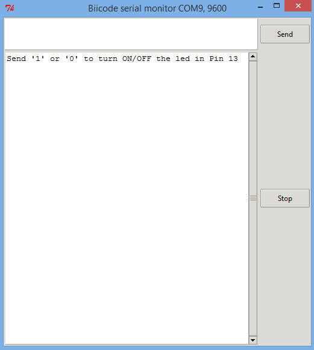

Arduino Serial Monitor
=======================

This example shows you how to run biicode's Arduino Serial Monitor Interface and turn ON/OFF one LED easily. If you don't know how to start using Arduino with biicode, check out our :ref:`Arduino Getting Started <arduino_getting_started>`.

C++ code
----------

Put the following file in your ``~/hive_name/blocks/your_user_name/block_name/``:

**monitor_led.cpp**

.. literalinclude:: ../../_static/code/arduino/examples/monitor_led.cpp
   :language: cpp

If you want, you can :download:`download the main file <../../_static/code/arduino/examples/monitor_led.cpp>`

Turn ON/OFF one LED
--------------------

First, upload this firmware to your Arduino:

.. code-block:: bash

    $ bii arduino:upload

    ...

    [100%] Built target [your_user_name]_monitor_led_main-upload

You shouldn't get any erros but if you do, please check your Arduino is correctly connected and your settings (bii arduino:settings).
If you still get any issues please contact us at our `forum <http://forum.biicode.com/category/arduino>`_

Now, open the Arduino monitor. It's easy, only execute this command:

.. code-block:: bash

    $ bii arduino:monitor

    ...

    Arduino detected on port [YOUR_PORT]

This interface is nice, it lets you communicate with the Arduino Serial Port.

Here you can send 1 or 0 to turn ON or turn OFF respectively.

