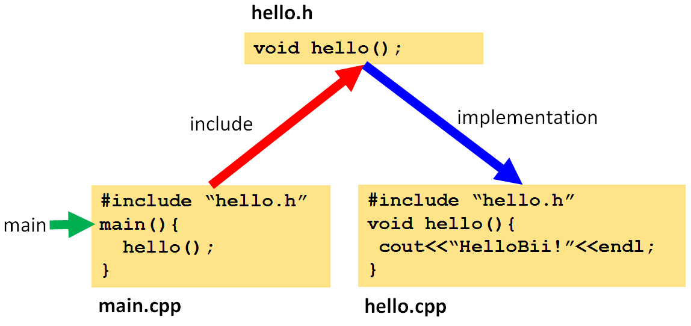

Meta-configuration of C/C++ projects with CMake
=========================================================================
.. toctree::
   :maxdepth: 1
   

Project configuration and setup
----------------------------------
Project configuration in software development is the process of setting up *how* your code will be build, managed and/or run. It is different depending on the programming language and used tools as IDE. For example, if programming in C/C++, the project setup typically involves defining which artifacts (executables, libraries) will be built from certain source code files, with given compiling and linking options. With Microsoft Visual, this can be done mostly with wizards, menu and contextual commands; e.g. you can configure your directories containing external libraries in a dialog (Project Properties). 

Other languages, especially those interpreted as node or python typically require much less project configuration or setup. In languajes as Java, typical project setups can be done with IDEs as Eclipse or Netbeans, but it is probably more extended the use of Maven, a tool that allows to define not only how a project must be built, packaged, executed or tested, but also to specify dependencies to binaries artifacts (jars) that can be retrieved from external servers.

In the C/C++ ecosystem, the best tool for project configuration is CMake. It allows with a simple syntax (at least for common people, simpler than writing Makefiles) to specify the build of a project in files named CMakeLists.txt and it can generate from them projects for the majority of IDEs and build systems in different OS. This is a must have tool, CMake is practically the de-facto standard in the industry for C/C++ multiplatform (and even for single OS) development. We love it, we have used it a lot in our own projects, and taught it from the first day in our Software Engineering courses at University as Professors.

C/C++ project meta-configuration
----------------------------------
What we call project meta-configuration? Probably you know about meta-programming, a process in which the code you write (as in C++ template), is really the specification or instructions of the real code that will actually be generated by a system (in the case of C++ templates, the compiler). 

In biicode we call meta-configuration to the process in which the project setup is (most times automatically) done, collecting information about the users intentions about the project from different origins. For example, the source code itself is a great source of information that can be exploited for this purpose.

Let's see it with an example, a "Hello world" one.

Imagine someone starts to write code, and writes the following three (simplified) files for a Hello World application.

Analyzing the source code, it is clear that the user wants to build an executable (from the main function, in green), that *includes* the file "hello.h" (red). Cross-checking declared and defined symbols in "hello.h" and "hello.cpp" it can be easily deduced that the implementation (blue) of the function hello() is found in the "hello.cpp" file, and so it is required to build the application. Accordingly, a CMakeLists.txt like the following could be automatically generated:

.. code-block:: cmake

	ADD_EXECUTABLE(main
                    main.cpp
                    hello.cpp)

What makes this automatic generation of the CMakeLists.txt file interesting? If a couple of new files are added and included by "main.cpp" or "hello.cpp", they will automatically be added to the executable. If the user wants to create a new executable, all they have to do is to write a file (with whatever name) with a main() function inside, i.e. the user just has to focus on writing code, practically the rest of the process can be automated. Although real large scale multiplatform projects usually have a complex building process which probably cannot be automatically fully deduced, this approach can be very valuable for students, programming courses, rapid prototyping and testing, etc. And for such large projects, lets see how can they benefit also from this approach.

Biicode approach to C++ projects meta-configuration
------------------------------------------------------
Biicode is a free tool (and it will always be free for OSS) created by C/C++ lovers to manage source code files dependencies in a novel way, facilitating the process of sharing and reusing source code.

Layout->Cmake, explain our files
Generated CMake files
^^^^^^^^^^^^^^^^^^^^^^

Integrating dependencies
^^^^^^^^^^^^^^^^^^^^^^^^^^^
Biicode allows a very simple publication and sharing of your source code to the biicode cloud, so you (or anyone in the world) can later very easily reuse it in another project. All you have to do to reuse previously published code is to write in your code a #include directive, that is of the form "username/block/path/to/file.h". If biicode does not find such file locally, it will look for it in biicode cloud, and retrieve it to your project, together with other files (included by or implementing such file). What happens with such source code?

It is retrieved as source code, not as binaries, so it has to be built locally. The source files could be just directly added to the executable, but it seems more intuitive to define a library that contains such files, as they wont be usually edited by the user, and link the executable to such library.

Advanced configuration
^^^^^^^^^^^^^^^^^^^^^^^^^^^
Why we call it meta-configuration instead of automated configuration? Because, is the user who specifies in a higher layer the configuration of the project. The automatic dependencies detection in C/C++ can sometimes fail, most times due to the usage of macros that a normal parser cannot handle. Other times, the programmer may want to specify they own dependencies because of advanced use cases, maybe using some kind of reflection, feature toggling, etc. This can be done in a file called *"dependencies.bii"* in which the user can add, remove or redefine dependencies between files.

CPPRules, transitivity

Editing CMakeLists.txt
^^^^^^^^^^^^^^^^^^^^^^^^^^^
The great news, thanks to the flexibility of CMake, Example of CMakeLists modification, e.g. Boost INCLUDE_DIR
User can use their own CMakeLists, or create block.cmake and include them

Conclusion
-------------
Summary of lack of libraries in biicode, disclaimer of beta.
But it has a great potential, we are working on it
Will always use CMake (we also use it in fortran)
Invitation to beta
