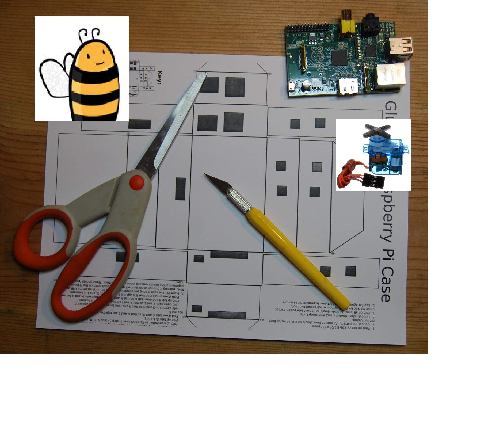

Code your christmas with Raspberry Pi and biicode
=================================================

Solo necesitamos papel, tijeras, un servo y biicode!

* Elige el diseño de muñeco que mas te guste.
* Montalo con unas pequeñas modificaciones.
* Pega la cabeza al servo.
* Pon el servo en el cuerpo y conectalo a los pines de 5v, GPIO17 y 0v.
* 