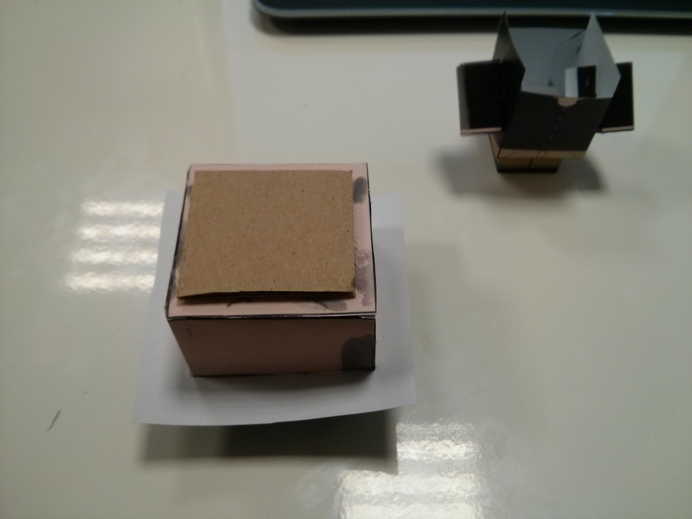
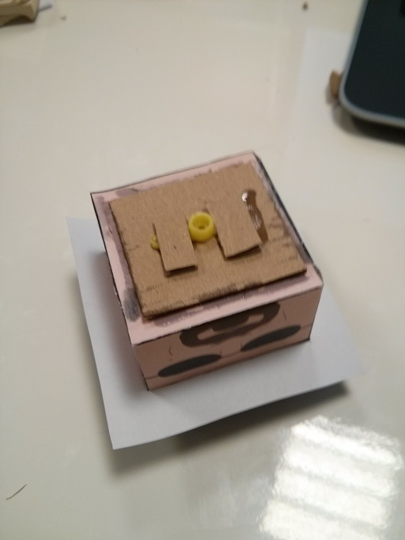
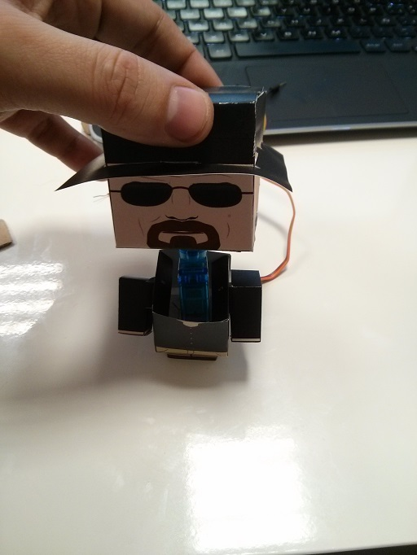

Christmas coding with Raspberry Pi and biicode: How to make a doll move
=======================================================================

Surprise your friends and family with a **moving doll** by following a few simple steps. 
Check out the video of our handcrafted Heisenberg paper doll at our office:

.. raw:: html

	<iframe width="640" height="480" src="//www.youtube.com/embed/S_oIqUt_CBo" frameborder="0" allowfullscreen></iframe>

You just need paper, scissors, a servo, a Raspberry Pi and biicode!
-------------------------------------------------------------------

* Sing up to `biicode <https://www.biicode.com/>`_
* :ref:`Install <installation>` biicode in a few easy steps.
* Get :ref:`here <raspberry_pi>` all the info you need to use your Raspberry Pi with biicode.
* To move the servo, just use the :ref:`WiringPi library <wiringpi>`, ready to be used in biicode.

.. code-block:: cpp
	:linenos:

	#include <stdio.h>
	#include <errno.h>
	#include <string.h>

	#include <drogon/wiringpi/wiringpi/wiringpi.h>
	#include <drogon/wiringpi/wiringpi/softservo.h>

	int main ()
	{
	  if (wiringPiSetup () == -1)
	  {
		fprintf (stdout, "oops: %s\n", strerror (errno)) ;
		return 1 ;
	  }

	  softServoSetup (0, 1, 2, 3, 4, 5, 6, 7) ;

	  softServoWrite (0,  500);
	  
	  int range = 500;
	  int vel = 10;

	  for (;;)
		softServoWrite (0,  range);
		range += vel;
		if (range > 1250 || range < -250)
		{
			vel = -vel;
		{
		delay (10);

	}

Choose the paper doll you like most
-----------------------------------

As fans of the TV Show we chose to move `Heisenberg <http://www.cubeecraft.com/cubee/heisenberg>`_ paper doll for our little experiment. Feel free to be creative making your own doll.

.. image:: raspberry_pi_christmas/01.jpg
.. image:: raspberry_pi_christmas/02.jpg

Putting it all together! 
------------------------

.. image:: raspberry_pi_christmas/1.jpg

Stick the head to the servo and put the servo in the body
---------------------------------------------------------

In the following pictures you can see how we built our doll:

.. image:: raspberry_pi_christmas/3.jpg
.. image:: raspberry_pi_christmas/4.jpg

.. image:: raspberry_pi_christmas/8.jpg

Connect the servo to the 5v, GPIO17 and 0v pins
-----------------------------------------------

If you need more information about the GPIO Reference :ref:`follow this link <rpigpio>`.

+-------+--------+
|Signal | GPIO17 |
+-------+--------+
| \+    |     5v | 
+-------+--------+
| \-    |     0v |
+-------+--------+

+----------------------------------------------+-------------------------------------------------+----------------------------------------------+
| GPIO Rev.1                                   | GPIO Pin Layout                                 | GPIO Rev.2                                   |
+----------------------------------------------+-------------------------------------------------+----------------------------------------------+
| .. image:: ../_static/img/rpi/gpiosr1.png    | .. image:: raspberry_pi_christmas/gpios.png     |    .. image:: ../_static/img/rpi/gpiosr2.png |
+----------------------------------------------+-------------------------------------------------+----------------------------------------------+

.. image:: raspberry_pi_christmas/servo.jpg 

Have fun with the moving doll!

Now having your doll moving, share it with your friends and family, make them laugh. We would also be happy to see other videos online. **Feel free to show us your most creative doll** :)
