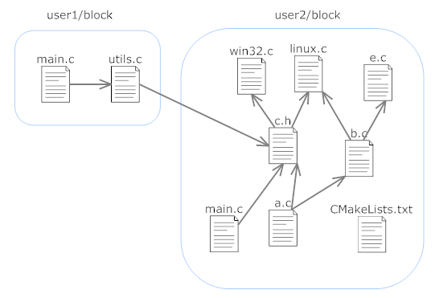
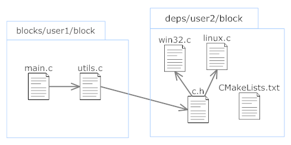

.. _cmake_advance:

Advanced use of CMake
=====================

.. _cpp_cmake_tutorials:

Operating mode
--------------

This is a conceptual example to learn how to use the CMake variables available in your computer.

Imagine someone **user2** , develops a project in a block that implements some functionality and uploads it to biicode.

**user2 layout**

.. code-block:: text

   |-- user2_project
   |    +-- bii
   |    +-- blocks
   |    |    +-- user2
   |    |    |    +-- block
   |    |    |    |    +-- bii
   |    |    |    |    |    |-- requirements.bii
   |    |    |    |    |    |-- parents.bii
   |    |    |    |    +-- CMakeLists.txt
   |    |    |    |    +-- c.h
   |    |    |    |    +-- a.c
   |    |    |    |    +-- b.c
   |    |    |    |    +-- e.c
   |    |    |    |    +-- win32.c
   |    |    |    |    +-- linux.c
   |    |    |    |    +-- main.c
   |    +-- deps

Another user, for example **user1**, **wants to reuse from user2's software** like this:

**user1 layout**

.. code-block:: text

   |-- user1_project
   |    +-- bii
   |    +-- blocks
   |    |    +-- user1
   |    |    |    +-- block
   |    |    |    |    +-- main.c
   |    |    |    |    +-- utils.c
   |    +-- deps

**Dependencies image**

Then, **user1** executes to retrieve the necessary files:

.. code-block:: bash

	~/user1_project$ bii find

So, the dependencies are solved and stored them locally on the local disk as follows:

This implies that biicode doesn't download all the block files, just the ones needed. However, **CMakeLists.txt is common to the whole block**, so it will operate in a way that enables it to work with only a subset of the block files.

Basic block CMakeLists.txt structure
^^^^^^^^^^^^^^^^^^^^^^^^^^^^^^^^^^^^

With the previous example on your mind, let's see the CMakeLists.txt structure that works with biicode. **Things to keep in mind**:

	* It's possible to write a block CMakeList.txt that works both, with and without biicode.
	|
	* To simplify, biicode, through ``bii cpp:configure`` and ``bii cpp:build`` commands, runs your CMakeLists.txt. 

The **basic block CMakeLists.txt structure** will be like this:

.. code-block:: cmake

	################### HEADER #########################
	# IT MUST BE INCLUDED AT THE BEGINNING

	INCLUDE(${CMAKE_HOME_DIRECTORY}/biicode.cmake)
	INIT_BIICODE_BLOCK()

	##################### ZONE 1 ########################
	# AFTER THIS POINT SOURCE VARIABLES COULD BE USED
	# FILE FILTER, CONFIGURATION, COMPILE DEFINITIONS, ETC

	ADD_BIICODE_TARGETS()

	##################### ZONE 2 ########################
	# AFTER THIS POINT TARGET VARIABLES COULD BE USED
	# ADDITIONAL LINKER FLAGS, LIBS, ETC

Variables
^^^^^^^^^

At first, you need to load a variety of macros automatically included in the CMake project folder. Once loaded, you can run ``INIT_BIICODE_BLOCK``, which fills a number of variables used to communicate CMake and biicode:

   * ``BII_BLOCK_NAME``, the name of the current block: ``block`` 
   * ``BII_BLOCK_USER``, the user's name: ``user2``
   * ``BII_BLOCK_PREFIX``, the deps/blocks folder directory where the block is located: ``deps``
   * ``BII_LIB_SRC``, a set of source code files needed to create the static library that is used by other project blocks: ``[“c.h” “win32.c” “linux.c”]``
   * ``BII_CREATE_LIB``: ``TRUE`` if you want to create the static library.
   * ``BII_<target>_SRC``: set of source code files needed to create the one target of the block. <target> is the name of the target but without the user_block part. In the example: in user2/block there is no additional target.  In user1/block there is a main and therefore the variable ``BII_main_SRC`` would be created if you include a CMakeLists.txt in that block.

After **ZONE 2**, or below ``ADD_BIICODE_TARGETS`` the following block variables related to the block targets are available:

   * ``BII_BLOCK_TARGETS``: a list with all CMake's target names Biicode generates. At **user1/block** it's a list with just one element ``user1_block_main``. While for **user2/block** it is  ``user2_block`` because that is the name automatically generated for the library that is target of the block.
 
   * ``BII_<target>_TARGET``, CMake targets the name of the target ``target``. At **user1/block**, it will create CMake target name of the target <target>. At user1/block, it'll create ``BII_main_TARGET``, whose content is **user1_block_mainBII_main_TARGET**, whose content is **user1_block_main**
   * ``BII_LIB_TARGET``, Cmake targets the name of the **library target of the block**. At **user2/block** the content of ``BII_LIB_TARGET`` is ``user2_block``.

Indeed, a few more variables are defined for certain operations, but they are not included here because they are out of the scope of this introductory manual, but if you got any further questions don't hesitate on asking at our `forum <http://forum.biicode.com/>`_.

Useful operations
-----------------

These are some basic operations that can help you write a ``CMakeLists.txt`` for a block:

Remove one or more source code files used in the generation of a target:
^^^^^^^^^^^^^^^^^^^^^^^^^^^^^^^^^^^^^^^^^^^^^^^^^^^^^^^^^^^^^^^^^^^^^^^^
.. image:: ../../_static/img/c++/cmake/blocks3.png 

For example, if **user2/block** is configured for Linux or Windows, a different file is added.  Initially Biicode includes both files into the target, so it is necessary to remove the implementation files that should not to be compiled. To do this, before generating the targets **ZONE 1** we add a code like this:

.. code-block:: cmake

	IF (WIN32)
	     list(REMOVE_ITEM BII_LIB_SRC linux.c)
	ELSE (WIN32)
	  list(REMOVE_ITEM BII_LIB_SRC win32.c)
	ENDIF (WIN32)

Add a build definition to the entire block:
^^^^^^^^^^^^^^^^^^^^^^^^^^^^^^^^^^^^^^^^^^^

.. code-block:: cmake

	add_definitions(-DUSER_FLAG_NAME)
	if(MSVC)
	  add_definitions(-D_CRT_SECURE_NO_DEPRECATE)
	endif(MSVC)

Add linker-flags to a target (in ZONE 2):
^^^^^^^^^^^^^^^^^^^^^^^^^^^^^^^^^^^^^^^^^

It is very common to accumulate these flags along **ZONE 1** in a temporary variable (in MYLIBS for example), and finally add them to a target or multiple targets in **ZONE 2**. As it is an interesting structure, we are doing so in this example although it can be done directly on the targets:

.. code-block:: cmake

	#AT ZONE 1:
	set(MY_LIBS "") 
	list(APPEND MY_LIBS "-lmingw32")
	#AT ZONE 2:
	target_link_libraries(${BII_LIB_TARGET} ${ MY_LIBS })

Add libraries and packages that are detectable by CMake:
^^^^^^^^^^^^^^^^^^^^^^^^^^^^^^^^^^^^^^^^^^^^^^^^^^^^^^^^

The only thing to keep in mind when performing this operation is to use the generic target defined by biicode. Otherwise it is exactly the same. In this case we will add OpenGL associating the target variables instead of the block. Thus in **Zone 2** we write:

.. code-block:: cmake

	find_package(OpenGL QUIET)
	if(OPENGL_FOUND)
	  include_directories(${OPENGL_INCLUDE_DIRS})
	  target_link_libraries(${BII_LIB_TARGET}${OPENGL_LIBRARIES})
	endif()

What can you do with biicode and CMake?
^^^^^^^^^^^^^^^^^^^^^^^^^^^^^^^^^^^^^^^

Given that the set of files that are to be used to generate the different targets are into ``BII_TARGET_SRC`` and  ``BII_LIB_SRC variables``, and the targets are identified  by ``BII_LIB_TARGET`` and ``<Target> BII_ _target``,  almost any operation acceptable by CMake  could be done. This gives the system all the versatility of CMake, combined with the powerful and stable dependencies management of biicode. 

How will user1 write the block CMakeLists.txt
^^^^^^^^^^^^^^^^^^^^^^^^^^^^^^^^^^^^^^^^^^^^^
Let's see how the user1/block CMakeLists.txt would be, even considering the possibility of using it without biicode:

.. code-block:: cmake

	#############BIICODE MACROS###################
	if(BIICODE)
	  include(${CMAKE_HOME_DIRECTORY}/biicode.cmake)
	  INIT_BIICODE_BLOCK()
	endif()
	#############################################
	IF(NOT BIICODE)
		project(myblock)
		FILE(GLOB BII_LIB_SRC  RELATIVE ${CMAKE_CURRENT_SOURCE_DIR}    
	         "${CMAKE_CURRENT_SOURCE_DIR}/*.c" "*.h" "*.cpp" )
	endif()

	#CMAKELIST script... as always
	SET(FILES_TO_REMOVE win32.c	
		macos.c
		linux.c
	main.c)

	IF(WIN32)
		list(REMOVE_ITEM FILES_TO_REMOVE win32.c)
	ELSEIF(APPLE)
		list(REMOVE_ITEM FILES_TO_REMOVE macos.c)
		add_definitions(USE_MAC_MEMMGR)
	ELSEIF(UNIX)
		list(REMOVE_ITEM FILES_TO_REMOVE linux.c)
	ENDIF()	

	###  LOOK AT THIS, if more targets are being build you should remove 
	###the files from all of them: 
	IF(BII_CREATE_LIB)
	  list(REMOVE_ITEM BII_LIB_SRC ${FILES_TO_REMOVE})
	ENDIF()
	IF(BII_main_SRC)
	  list(REMOVE_ITEM BII_main_SRC ${FILES_TO_REMOVE})
	ENDIF()
	#############################################
	if(BIICODE)
		ADD_BIICODE_TARGETS()
	else()
		add_library(myblocklib ${BII_LIB_SRC})
		add_executable(myexe main.c ${BII_LIB_SRC})
	endif()

If you got any questions left, you can ask them at our `forum <http://forum.biicode.com/>`_.

