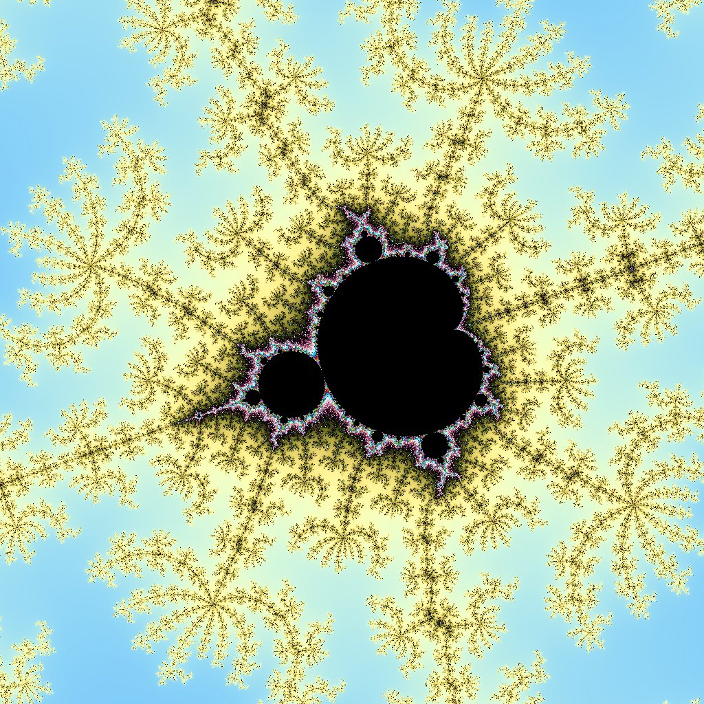

.. _tinythread_examples:

TinyThread++
============

`TinyThread++ <http://tinythreadpp.bitsnbites.eu/>`_  TinyThread++ is a minimalist, portable, threading library for C++, intended to make it easy to create multi threaded C++ applications. The library is closesly modeled after the C++11 standard, but only a subset is implemented at the moment.
Need portable threads for your C++ app? Use TinyThread++

The main block is `here <https://www.biicode.com/david/david/tinythread/master>`_, which is generated
from this `github repo <https://github.com/davidsanfal/tinythread>`_

Open and build the examples
---------------------------

This example is `already in biicode <http://www.biicode.com/examples/tinytread>`_,
it is very simple to build it, by just opening the block and building it.

.. code-block:: bash

   $ bii init tinythread
   $ cd tinythread
   $ bii open examples/tinythread
   $ bii cpp:build

Simple Hello World with a thread
--------------------------------

Now, run the hello example.

.. code-block:: bash

   $ bin/examples_tinythread_hello

You should see how a thread say "Hello world!"

This hello world just new to define the trhead method.

.. code-block:: cpp

	void HelloThread(void * aArg)
	{
	  cout << "Hello world!" << endl;
	}

and then, launch the thread and wait for it.

.. code-block:: cpp

  thread t(HelloThread, 0);
  t.join();

You can see all the code `here <https://www.biicode.com/examples/examples/tinythread/master/1/hello.cpp>`_.

Draw a fractal
--------------

If you run the fractal example, a set of threads will be launched to generate a fractal image. You can see how to launch diferent threads to do a distrituted task.

.. code-block:: cpp

  // Start calculation threads (we run one thread on each processor core)
  cout << "Running " << numThreads << " calculation thread(s)..." << flush;
  list<thread *> threadList;
  for(int i = 0; i < numThreads; ++ i)
  {
    thread * t = new thread(CalcThread, (void *) &dispatcher);
    threadList.push_back(t);
  }

  // Wait for the threads to complete...
  for(list<thread *>::iterator i = threadList.begin(); i != threadList.end(); ++ i)
  {
    thread * t = *i;
    t->join();
    delete t;
  }
  cout << "done!" << endl;

  // Write the final image to a file
  cout << "Writing final image..." << flush;
  img.WriteToTGAFile("fractal.tga");
  cout << "done!" << endl;

You can see all the code `here <https://www.biicode.com/examples/examples/tinythread/master/1/fractal.cpp>`_.

.. code-block:: bash

   $ bin/examples_tinythread_fractal

