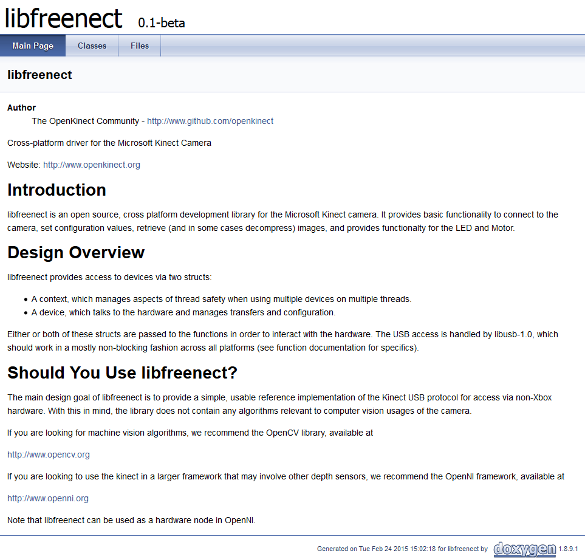

.. _integration:

Integrations
============

Biicode integrates with other technologies and tools. We're already working with the services below:

.. _git_integration:

VCS Git (GitHub, Bitbucket, etc.)
---------------------------------

|github_homepage| and |bitbucket_homepage| are notorious Git (Bitbucket works with Mercurial too) repository web-based hosting service which offer the distributed revision control and source code management (SCM) functionality of Git as well as add their own features.

Biicode has some commands similar to VCS management but we recommend greatly to work with Git and host in any web you want. GitHub and Bitbucket work brilliantly and you can work painless with your repositories and building your project with biicode to reuse or share later. You only have to ``init`` your repository into your block folder. As in the example:

.. code-block:: bash

	~$ bii init mygitproject
	~$ cd mygitproject/blocks
	~/mygitproject/blocks$ mkdir myusername
	~/mygitproject/blocks/myusername$ git clone your_repository
	~/mygitproject/blocks/myusername$ bii cpp:build

.. _appveyor_integration:

AppVeyor
---------

|appveyor_homepage| provides Continuous Integration and Deploy for Windows and it's compatible with both GitHub and BitBucket. Place an ``appveyor.ymĺ`` file in your repo and each time you push to your Github repository it will kick-off a new build in Windows, executing your tests and publishing this project to your biicode user account. 

Login AppVeyor and clic on ``+ NEW PROJECT`` and choose the repo you want to deploy with AppVeyor. Create an ``appveyor.yml`` file in your local project to automatically publish your block to biicode, including your version tags, here's an example file: ::

    version: 1.0.{build}

    install:
      - ps: wget https://s3.amazonaws.com/biibinaries/thirdparty/cmake-3.0.2-win32-x86.zip -OutFile cmake.zip
      - cmd: echo "Unzipping cmake..."
      - cmd: 7z x cmake.zip -o"C:\Program Files (x86)\" -y > nul
      - cmd: set PATH=%PATH:CMake 2.8\bin=%;C:\Program Files (x86)\cmake-3.0.2-win32-x86\bin
      - cmd: cmake --version
      - cmd: echo "Downloading biicode..."
      - ps: wget http://www.biicode.com/downloads/latest/win -OutFile bii-win.exe
      - cmd: bii-win.exe /VERYSILENT
      - cmd: set PATH=%PATH%;C:\Program Files (x86)\BiiCode\bii
      - cmd: bii -v
      - cmd: del bii-win.exe
      - cmd: del cmake.zip

    before_build:
      - cmd: cd \
      - cmd: bii init %project_name%
      - cmd: cd %project_name%
      - cmd: bii new %block_user%/%block_name%
        # copy files and folders
      - cmd: xcopy "%APPVEYOR_BUILD_FOLDER%" blocks\%block_user%\%block_name%\ /e
      - cmd: bii cpp:configure -G "Visual Studio 12"

    build_script:
      - cmd: bii cpp:build

    test_script:
      - cmd: cd bin
      - cmd: amalulla_cpp-expression-parser_test-shunting-yard.exe
    
    deploy_script:
      - cmd: bii user %block_user% -p %secured_passwd%
      - if defined APPVEYOR_REPO_TAG_NAME set VERSION=%APPVEYOR_REPO_TAG_NAME%  
      - if defined APPVEYOR_REPO_TAG_NAME bii publish --tag=%tag% --versiontag=%VERSION% 
      - if not defined APPVEYOR_REPO_TAG_NAME bii publish --tag=%dev_tag% 

    on_success:
      - cmd: cd /%project_name%/blocks/%block_user%/%block_name%
      - ps: |    
            $new_biiconf = get-content biicode.conf
            $orig_biiconf = get-content "$env:APPVEYOR_BUILD_FOLDER\biicode.conf"     
            if (diff $new_biiconf $orig_biiconf){
               'different, updating biicode parents'
               git checkout "$env:APPVEYOR_REPO_BRANCH"
               git config --global core.autocrlf true
               git config --global credential.helper store 
               Add-Content "$env:USERPROFILE\.git-credentials" "https://$($env:access_token):x-oauth-basic@github.com`n"
               git remote add neworigin "$env:github_repo"
               git config --global user.email "$env:github_email"
               git config --global user.name "$env:github_user"
               git add biicode.conf
               git commit -m "Updated biicode parents [skip ci]"
               git push neworigin "$env:APPVEYOR_REPO_BRANCH"
               }Write-Host "Updated biicode parents" else {
                'equal, no parents update needed'
              }

    environment:
      project_name:
        "myproject"
      block_user:
        "amalulla"
      block_name:
        "cpp-expression-parser"
      secured_passwd:
        secure: ZMvgETfLAUo7kISnvrinBA==
      access_token:
        secure: GdIDIRkmsM9blqS143lQErkxguMYgJBs74GzWw+lgzjvl/NoLs4ErcOZ2JBAEmkr
      tag:
        "STABLE"
      dev_tag:
        "DEV"
      github_user:
        "MariadeAnton"
      github_email:
        "maria.deanton@biicode.com"
      github_repo:
        "git@github.com:MariadeAnton/cpp-expression-parser.git"

Use your own ``test_script`` and ``environment`` values to start deploying with it.

Here's an appveyor guide about how to |appveyor_git_push|. Following this Appveyor Guide we're using it as credentials with Git commands. Use this GitHub guide to create your |github_access_token|.

Encrypt your biicode password and your access token using |appveyor_encrypt_data|, copy the values generated and put them it in your  environment like ``secured_password: secure:``.

What's going on the ``appveyor.yml`` file?

   * ``install:`` This part installs all tools required to deploy your biicode projects in AppVeyor.
   * ``before_build:`` Moves your project's files into the biicode project and configures it to use Visual Studio 12 via ``bii cpp:configure``.  Check biicode docs and  your project's settings in Appveyor to use other build configurations. **Also note** that there's a commented line here you should also write if your project contains folders.
   * ``test_script:`` cd bin and execute your project. Ensure about your project's executable, build and execute it locally with  ``bii cpp:build``.
   * ``deploy_script:`` This script publishes your block to biicode, including your version tag only when it's tagged.
   * ``on_success:`` If your biicode.conf file is updated commit its changes to github without launching a new build. Else do nothing.
   * ``environment:`` Replace all environment variables here with your values: project_name, tag, default version tag value... Also your encrypted variables.

You can see this live example here:

* |github_appveyor_parser| in GitHub
* |appveyor_build_parser| in AppVeyor
* |biicode_block_parser| with its automatically published releases

Learn more about AppVeyor visiting their `docs <http://www.appveyor.com/docs>`_.

.. _travis_integration:

Travis CI
---------

|travis_homepage| takes care of running your tests and deploying your apps. Like we work with VCS, many of the blocks published in our web have their ``.travis.yml`` files, that lets us pushing to our GitHub repository, and automatically build in Linux, execute and publish this project with your biicode user account thanks to this excellent service.

If you're working with it, the ``.travis.yml`` file format will help to automatically publish to your biicode account with DEV tag unless your github repo is tagged, in this case, imports the tag and publishes as STABLE to biicode. ::

    language: cpp
    compiler:
    - gcc
    before_install:
    - export TRAVIS_COMMIT_MSG="$(git log --format=%B --no-merges -n 1)"
    - if [[ "$TRAVIS_COMMIT_MSG" = "$COMMIT_IGNORE_BUILD" ]]; then exit 0 ; fi
    - if [ "$CXX" == "g++" ]; then sudo add-apt-repository -y ppa:ubuntu-toolchain-r/test;
      fi
    - sudo apt-get update -qq
    - git config --global user.email "$USER_EMAIL"
    - git config --global user.name "$USER_NAME"
    - git config --global push.default simple
    - git checkout $TRAVIS_BRANCH
    install:
    - if [ "$CXX" == "g++" ]; then sudo apt-get install -qq g++-4.8; fi
    - if [ "$CXX" == "g++" ]; then sudo update-alternatives --install /usr/bin/g++ g++
      /usr/bin/g++-4.8 50; fi
    - wget http://www.biicode.com/downloads/latest/ubuntu64
    - mv ubuntu64 bii-ubuntu64.deb
    - sudo dpkg -i bii-ubuntu64.deb && sudo apt-get -f install
    - rm bii-ubuntu64.deb
    - wget https://s3.amazonaws.com/biibinaries/thirdparty/cmake-3.0.2-Linux-64.tar.gz
    - tar -xzf cmake-3.0.2-Linux-64.tar.gz
    - sudo cp -fR cmake-3.0.2-Linux-64/* /usr
    - rm -rf cmake-3.0.2-Linux-64
    - rm cmake-3.0.2-Linux-64.tar.gz
    - export TRAVIS_CXX=$CXX
    script:
    - cd /tmp
    - bii init biicode_project
    - mkdir -p ./biicode_project/blocks/$USER/$BLOCK_NAME
    - cd biicode_project/blocks/$USER/$BLOCK_NAME
    - shopt -s dotglob && mv $TRAVIS_BUILD_DIR/* ./
    - if [ "$CXX" == "clang++" ]; then export CXX="clang++" && bii cpp:build; fi
    - if [ "$CXX" == "g++" ];     then export CXX="g++"     && bii cpp:build; fi
    - cd /tmp/biicode_project
    ##################### CHANGE WITH YOUR CUSTOM CHECKS OR TEST EXECUTION ##################
    - ls ./bin/lasote_docker_client_example_main
    #########################################################################################
    after_success:
    - bii user $USER -p $BII_PASSWORD
    - if [[ -n $TRAVIS_TAG ]]; then bii publish -r --tag STABLE --versiontag $TRAVIS_TAG
      || echo "Ignored publish output..."; fi
    - if [[ -z $TRAVIS_TAG ]]; then bii publish -r || echo "Ignored publish output...";
      fi
    # If there are changes, commit them
    - cd /tmp/biicode_project/blocks/$USER/$BLOCK_NAME
    - git config credential.helper "store --file=.git/credentials" 
    - echo "https://${GH_TOKEN}:@github.com" > .git/credentials
    - git add -A .
    - git commit -m "$COMMIT_IGNORE_BUILD" 
    - git remote -v
    - git remote set-url origin https://github.com/$TRAVIS_REPO_SLUG.git 
    - git push
    env:
      global:
      - USER_EMAIL=lasote@gmail.com
      - USER_NAME="Luis Martinez de Bartolome"
      - COMMIT_IGNORE_BUILD="Promoted version.***travis***"
      - BLOCK_NAME=docker_client
      - USER=lasote
      # BII_PASSWORD: Biicode USER's password. > travis encrypt BII_PASSWORD=XXXXXX --add
      - secure: ENCRYPTED_BIICODE_PASSWORD_HERE
      # GH_TOKEN: Github token > travis encrypt GH_TOKEN=XXXXXX --add
      - secure: NCRYPTED_GITHUB_PASSWORD_HERE

What's going on the ``.travis.yml`` file?

    * ``language and compiler`` are totally clear (this is where you choose the language and compiler that Travis CI will use).
    * ``before_installing``, stablishes our automatic commit must be ignored and configures git to push later, on the after_success part.
    * ``install`` provides the tools necessary to test our code with BIICODE.
    * ``script``, creates, builds and runs the project and checks if the project successes.
    * ``after_success`` part is to publish your project to biicode as STABLE with VERSION_TAG if tagged in github, otherwise it publishes as DEV. Also, if your biicode.conf file is updated, this commits its changes to github without launching a new build.
    * ``env:`` replace all environment values with your own ones. Don’t delete the ***travis*** text, as it is the one needed to specify that commit should skip build, avoiding entering an endless build loop.

To learn more about Travis using C++ language, visit its `documentation <http://docs.travis-ci.com/user/languages/cpp/>`_.

.. container:: infonote

   Here's how to `automatically build and publish via Travis CI and Github  <http://blog.biicode.com/automatically-build-publish-via-travis-ci-github/>`_. You can also `deploy directly with biicode <http://docs.travis-ci.com/user/deployment/biicode/>`_. 

Koding
------

|koding_homepage| gives you the necessary environment to start developing your apps, run them, collaborate and share with the world. This amazing development tool helps you to work with a great environment everywhere, without installing or executing difficult commands, you've already all the necessary prepared in your Koding account.

If you're signed here and you wish to use biicode in your VMs, then execute:

.. code-block:: bash

	~$ wget http://apt.biicode.com/install.sh && chmod +x install.sh && ./install.sh
	~$ bii -h

Then, you'd ready to start using biicode and building all the projects you wish.

Doxygen
-------

|doxygen_homepage| is the standard tool for generating documentation from annotated C++ sources. You can download it from its |doxygen_downloads|.

   * It can generate an on-line documentation browser (in HTML) and/or an off-line reference manual (in LaTeX) from a set of documented source files. There is also support for generating output in RTF (MS-Word), PostScript, hyperlinked PDF, compressed HTML, and Unix man pages. The documentation is extracted directly from the sources, which makes it much easier to keep the documentation consistent with the source code.

   * You can configure doxygen to extract the code structure from undocumented source files. This is very useful to quickly find your way in large source distributions. Doxygen can also visualize the relations between the various elements by means of include dependency graphs, inheritance diagrams, and collaboration diagrams, which are all generated automatically.

1. Create a Doxyfile template
^^^^^^^^^^^^^^^^^^^^^^^^^^^^^

.. code-block:: bash

    ~$ cd /blocks/[USER]/[BLOCK]
    ~/blocks/[USER]/[BLOCK]$ mkdir docs
    ~/blocks/[USER]/[BLOCK]$ cd docs
    ~/blocks/[USER]/[BLOCK]/docs$ doxygen -g

2. Edit your Doxyfile
^^^^^^^^^^^^^^^^^^^^^

The minimal info that you need to change in your Doxyfile is the following tags: ::

    PROJECT_NAME           = "My Project"

    OUTPUT_DIRECTORY       = .

    INPUT                  = ../

    FILE_PATTERNS          = *.c \
                             *.cc \
                             *.cxx \
                             *.cpp \
                             *.c++ \
                             *.h \
                             *.hh \
                             *.hxx \
                             *.hpp \
                             *.h++ \

3. Genearte the Documentation
^^^^^^^^^^^^^^^^^^^^^^^^^^^^^

.. code-block:: bash

    ~/docs$ doxygen Doxyfile

    #Open the /docs/html/index.html with your web browser.

.. container:: infonote

   All the info of the previous examples have been written taking as reference a ``docs`` folder inside your ``block``.

   However, you can create your Doxyfile where you want changing the INPUT tag in your Doxyfile.

   For example, if you want to generate the docs folder in you ``project``, you need to specify ``INPUT = ../blocks/[USER]/[BLOCK_NAME]/``.

   If you need to read more info about doxygen, you can `read de official documentation. <http://www.stack.nl/~dimitri/doxygen/manual/index.html>`_

If you want to make your own main page, you can create a ``DoxygenMainpage.h`` in the docs folder with the following sections: ::

    /**
    @mainpage  TITLE_OF_YOUR_HOME_PAGE
    
    @author YOUR_USER_NAME and all the info about the author

    Description of you block

    @section TITLE

    Section info
    */

A good example is |doxygen_doxygenmainpage|:

.. code-block:: cpp 
    :emphasize-lines: 2,3,9,17,30

    /**
    @mainpage  libfreenect
    @author The OpenKinect Community - http://www.github.com/openkinect

    Cross-platform driver for the Microsoft Kinect Camera

    Website: http://www.openkinect.org

    @section libfreenectIntro Introduction

    libfreenect is an open source, cross platform development library for
    the Microsoft Kinect camera. It provides basic functionality to
    connect to the camera, set configuration values, retrieve (and in some
    cases decompress) images, and provides functionalty for the LED and
    Motor.

    @section libfreenectDesignOverview Design Overview

    libfreenect provides access to devices via two structs:

    - A context, which manages aspects of thread safety when using
      multiple devices on multiple threads.
    - A device, which talks to the hardware and manages transfers and configuration.

    Either or both of these structs are passed to the functions in order
    to interact with the hardware. The USB access is handled by
    libusb-1.0, which should work in a mostly non-blocking fashion across
    all platforms (see function documentation for specifics).

    @section libfreenectShouldIUseIt Should You Use libfreenect?

    The main design goal of libfreenect is to provide a simple, usable
    reference implementation of the Kinect USB protocol for access via
    non-Xbox hardware. With this in mind, the library does not contain any
    algorithms relevant to computer vision usages of the camera.

    If you are looking for machine vision algorithms, we recommend the
    OpenCV library, available at

    http://www.opencv.org

    If you are looking to use the kinect in a larger framework that may
    involve other depth sensors, we recommend the OpenNI framework,
    available at

    http://www.openni.org

    Note that libfreenect can be used as a hardware node in OpenNI.

    */

.. |doxygen_homepage| raw:: html

   <a href="http://www.stack.nl/~dimitri/doxygen/" target="_blank">Doxygen</a>

.. |doxygen_downloads| raw:: html

   <a href="http://www.stack.nl/~dimitri/doxygen/download.html" target="_blank">downloads page</a>

.. |doxygen_doxygenmainpage| raw:: html

   <a href="https://www.biicode.com/david/david/libfreenect/master/0/doc/DoxygenMainpage.h" target="_blank">libfreenect/doc/DoxygenMainpage.h</a>

.. |appveyor_homepage| raw:: html

   <a href="https://ci.appveyor.com/" target="_blank">AppVeyor</a>

.. |github_homepage| raw:: html

   <a href="https://github.com/" target="_blank">GitHub</a>

.. |bitbucket_homepage| raw:: html

   <a href="https://bitbucket.org/" target="_blank">Bitbucket</a>

.. |travis_homepage| raw:: html

   <a href="https://travis-ci.com/" target="_blank">Travis CI</a>

.. |koding_homepage| raw:: html

   <a href="https://koding.com/Home" target="_blank">Koding</a>

.. |github_appveyor_parser| raw:: html
   
   <a href="https://github.com/MariadeAnton/cpp-expression-parser" target="_blank">Forked cpp-expresion-parser repo</a>

.. |github_access_token| raw:: html
   
   <a title="github personal access token" href="https://help.github.com/articles/creating-an-access-token-for-command-line-use/" target="_blank">GitHub Personal Access Token</a>

.. |appveyor_build_parser| raw:: html

   <a title="appveyor build cpp-expression-parser" href="https://ci.appveyor.com/project/MariadeAnton/cpp-expression-parser" target="_blank">cpp-expression-parser builds</a>

.. |appveyor_encrypt_data| raw:: html

   <a title="appveyor encrypt data tool" href="https://ci.appveyor.com/tools/encrypt" target="_blank">Encrypt Data tool</a>

.. |appveyor_git_push| raw:: html

   <a title="appveyor git push from build" href="http://http://www.appveyor.com/docs/how-to/git-push" target="_blank">Git push from Appveyor Build</a>
   

.. |biicode_block_parser| raw:: html

   <a href="http://www.biicode.com/amalulla/cpp-expression-parser" target="_blank">cpp-expression parser biicode block</a> 

**Got any doubts?** `Ask in our forum <http://forum.biicode.com>`_
