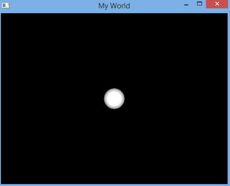

.. _freeglut:

Freeglut
===========

This example shows you some basic code to get started in **OpenGL world**. ``Freeglut`` is a completely OpenSourced alternative to the OpenGL Utility Toolkit (GLUT) library and allows you to create and manage windows containing OpenGL contexts on a wide range of platforms (also read the mouse, keyboard and joystick functions). You can visit the following pages to learn more about OpenGL and GLUT (and hence freeglut):

   1. `The Official Guide to Learning OpenGL v1.1 <http://glprogramming.com/red/>`_
   2. `List of OpenGL methods <http://www.talisman.org/opengl-1.1/Reference.html>`_
   3. `The Free OpenGL Utility Toolkit <http://freeglut.sourceforge.net/>`_
   4. `List of GLUT methods <http://www.opengl.org/documentation/specs/glut/spec3/node1.html>`_

1. Create a new hive
--------------------

Create a new hive as described in the :ref:`hello world example <hello_world>`.
For this example we should select ``cpp`` as programming language, name our hive ``cpp_freeglut_hive`` and the block ``cpp_freeglut``.
We don't need to generate a default hello world.

.. code-block:: bash
   :emphasize-lines: 1, 3, 5, 6

   $ bii new cpp_freeglut_hive
   ...

   Select language: (java/node/fortran/python/cpp/arduino/None)
   Introduce lang (default:None): cpp
   How would you like to name your first block?
   Introduce block name: cpp_freeglut
   Generate a default hello world?  (YES/no) no
   Select IDE family: (Visual/CodeBlocks/Eclipse/NetBeans/None)
   Introduce ide (default:None): [ENTER]
   Select build type: (None/Debug/Release/RelWithDebInfo/MinSizeRel)
   Introduce build_type (default:Debug): [ENTER]

  

2. Creating reusable code
--------------------------

It would be interesting to create an example which can be reused by you or by other biicode users.

**sphere.h**

.. literalinclude:: ../_static/code/cpp/examples/freeglut/sphere.h
   :language: cpp
   :emphasize-lines: 2

**sphere.cpp**

.. literalinclude:: ../_static/code/cpp/examples/freeglut/sphere.cpp
   :language: cpp

**main.cpp**

.. literalinclude:: ../_static/code/cpp/examples/freeglut/main.cpp
   :language: cpp

**You can download these files here:** :download:`sphere-glut.zip <../_static/code/cpp/examples/freeglut/sphere-glut.zip>`, unzip and copy them into your ``cpp_freeglut`` block folder.

3. Find dependencies
----------------------

These files need to link with freeglut library, then you have to find this dependency in biicode with ``find`` command.

.. code-block:: bash

   $ cd cpp_freeglut_hive
   $ bii find

You should see a successful message that all dependencies have been resolved.

4. Build and run
---------------------

Finally, you can build your main file and run it with the ``bii cpp:run`` command. If you only want to build it, just use ``bii cpp:build``.

.. code-block:: bash

   $ bii cpp:run

**That's it!** You should see a new window named "My World" and a solid white sphere in the middle of it like this:

If you have errors executing it, go to `forum biicode <http://forum.biicode.com/>`_ or :ref:`faqs about C/C++ <faqs_cpp>` and check if your problem is resolved there, else open a new topic in C/C++ category and we resolve it as soon as possible.

