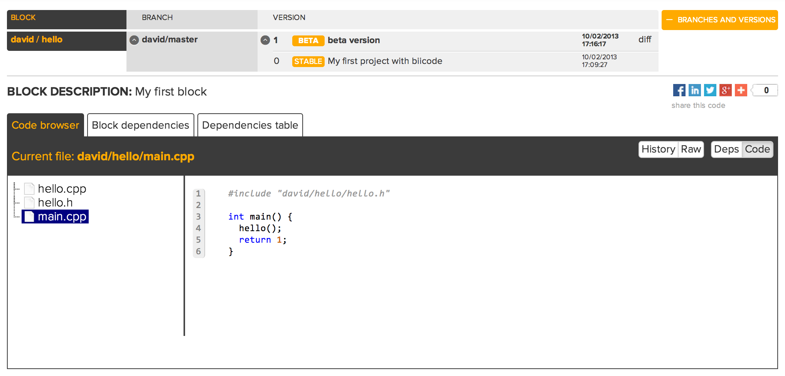

.. _hello_world_node:

"Hello World!" in node.js
=========================

This example shows how to build a simple *'Hello World'* node application with biicode.

1. Create a new hive
--------------------

Creating a new hive is as easy as executing the ``bii new`` command. Open your console, move to your :ref:`biicode workspace <create_workspace>` and create a new hive named ``node_hello_hive`` (some ouput informative messages are omitted):

.. code-block:: bash

   $ bii new node_hello_hive

The system will prompt you for your hive initial programming language, you can select among several options.
Select ``node`` here.

It will also prompt for **your first block name**. A block is a working unit you can publish and navigate in the web.
You can have more than one block in your hives, but now lets start with just one. Enter a descriptive name,
something that summarizes the functionality of all the files that will be in that block. Enter ``node_server``.

.. code-block:: bash

   Select language: (java/node/fortran/python/cpp/arduino/None)
   Introduce lang (default:None): node
   How would you like to name your first block?
   Introduce block name: node_server

   
This command will create the following layout:

.. code-block:: text

   +-- node_hello_hive
         +-- blocks
         |     +-- username
         |          +-- node_server
         +-- deps
  

Now, create create inside your ``username/node_server`` a ``main.js`` file with the following contents (you can use your favorite text editor):

.. literalinclude:: ../_static/code/node/main.js
   :language: javascript

2. Run
------

Now, you are ready to run your —yet— simple program using the ``bii node:run`` command.

.. code-block:: bash

   $ cd node_hello_hive
   $ bii node:run
   ...
   Hello world!

**That's it!** Your console should display now a **Hello world!** message. You can try changing the ouput message!

3. Creating reusable code
-------------------------

The previous example is not very interesting, and doesn't show biicode's potential. Let's create some code that could be reused by other biicode users.

node.js provides as part of its standard library with a basic http server. We are going to create a small function that encapsulates the creation of a http server that returns a given string as http body response. Replace the previous simple ``main.js`` file with the following two new files:

**server.js**

.. literalinclude:: ../_static/code/node/server.js
   :language: javascript

**caller.js**

.. literalinclude:: ../_static/code/node/caller.js
   :language: javascript

You can download these files here: :download:`hello_node.zip <../_static/code/node/hello_node.zip>`, unzip and copy them into your ``node_server`` block folder. Run the new program to verify that it works as expected! Now, open the address http://localhost:8888 in your web browser, and enjoy the result!

4. Publish your code
--------------------

Once your have written, and successfully executed some code, surely you are willing to share it with the biicode community! **Uploading your code to biicode** is really simple using the ``bii publish`` command. You will be requested to provide a **tag** and a **message**. Valid tags are ``STABLE``, ``ALPHA``, ``BETA``, and ``DEV``, providing information about the development state of your hive. The message must convey some information about your new publication, and the features it contains.

.. code-block:: bash

   $ bii publish                                                            

   block:   username/node_server
   Introduce tag: STABLE                                                           
   Introduce msg: My first http server
   
   INFO: Successfully published username/node_server(username/master): 0

If your code has been published correctly —as it is the case in the previous example—, you can already browse its contents online, on the biicode web site, visiting the url: ``www.biicode.com/username``. You can see `an example of a published block following this link <https://www.biicode.com/david/blocks/david/hello/branches/master>`_. In this example the biicode user ``david`` has pusblished a block named ``hello``. You can browse online the block contents and files, and inspect all branches and versions for this block:

5. Reuse it!
------------

One of the most interesting aspects of biicode is the ability it provides to easily reuse code. As the published files have already been uploaded to biicode servers, it is possible for anyone —even other biicode users— to use these files in new projects. We'll show the process creating a new hive named ``node_use_server_hive``. From your biicode workspace folder, execute again the ``bii new`` command to create a new hive:

.. code-block:: bash

   $ bii new node_use_server_hive

Now you should configure this hive as you did before, but in this case **the initial block must have a different name**: ``node_use``, for example.

Add the following files to the folder ``node_use_server_hive/blocks/username/node_use`` (remember to substitute ``username`` with your actual biicode user name):

**new_use.js**

.. literalinclude:: ../_static/code/node/new_use.js
   :language: javascript

You can also download that file here: :download:`new_use.js <../_static/code/node/new_use.js>`. Copy that file into your block's folder.

In this case we are using of the ``start_http(text)`` function, which is not explicitly defined in the current hive. If you tried to run this program from your new hive's path using the ``bii node:run`` command, you would see an error message:

.. code-block:: bash

   $ bii node:run
   ...
   ... : No such file or directory
   Error: Cannot find module 'username/node_server/server'

However, biicode knows that you are trying to reuse the ``server.js`` header contained in the ``node_server`` block. To resolve the missing dependencies we use the ``bii find`` command. Hopefully the server will find the dependencies, and you will see a success message on your screen:

.. code-block:: bash

   $ bii find
	
This is a successful ouput that indicates biicode has been able to resolve your dependencies. All needed files have been automatically downloaded and copied to your hive (you will find the ``username/node_server`` block along with the retrieved source file ``server.js`` inside your hive's ``deps`` subfolder).

Now you can try to run again your new code. In this case the process will succeed:

.. code-block:: bash

   $ bii node:run
   ...
   Server has started.

 Note that the ``caller.js`` file contained in the reused ``node_server`` block was not retrieved. That is because you don't need it to reuse the ``start_http(text)`` function!

6. Publish a new version of your node_server block
--------------------------------------------------

Modifying your code and publishing the results is easy with biicode. Now we'll change the message displayed by the ``start_http(message)`` function in the ``username/node_server`` block. Update the ``server.js`` file with the following new code:

**server.js**

.. literalinclude:: ../_static/code/node/server_v2.js
   :language: javascript
   
Run your code, to make sure everything works as expected. The output message of the http server should have changed.

Now, post your updated block version to the biicode server just as you did before, using again the ``bii publish`` command. From your hive folder:

.. code-block:: bash

   $ bii publish
   block:     username/node_server
   Introduce tag: STABLE
   Introduce msg: My first node server block update
   ...
   Successfully published username/node_server(username/master): 1

As you can see, the version of your block changed from 0 to 1. Your can see both versions published online visiting your biicode user main page, as before.

7. Update your node_use block with the modifications
----------------------------------------------------

To update your ``username/node_server`` block with the new modifications to the ``start_http(text)`` function, **you only need to search the server for any published new versions of your dependencies** using the ``bii find`` command and the ``--update`` modifier. If the server finds new published versions for any of your dependencies, you'll see an indicative message on your screen:

.. code-block:: bash

   $ cd node_use_server_hive
   $ bii find --update
   ...

Finally, you can test the updated code running:

.. code-block:: bash

   $ bii node:run
   ...
   Server v2 has started.

**Now you might be interested in:**

   - If something went wrong, you might want to `find some help in the forum <http://forum.biicode.com/category/nodejs>`_, and open a new topic if necessary.
   - I don't want to publish my block, as it doesn't work yet, but I want to save my hive for continuing later in a different computer. :ref:`Read here to check how <hive_usage>`.
