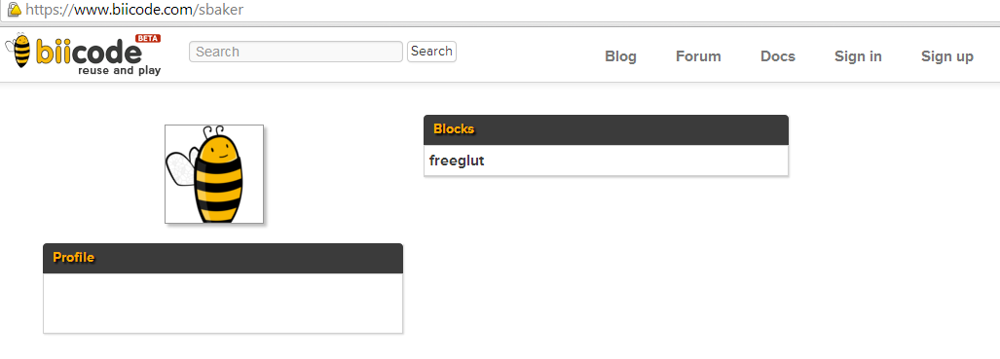
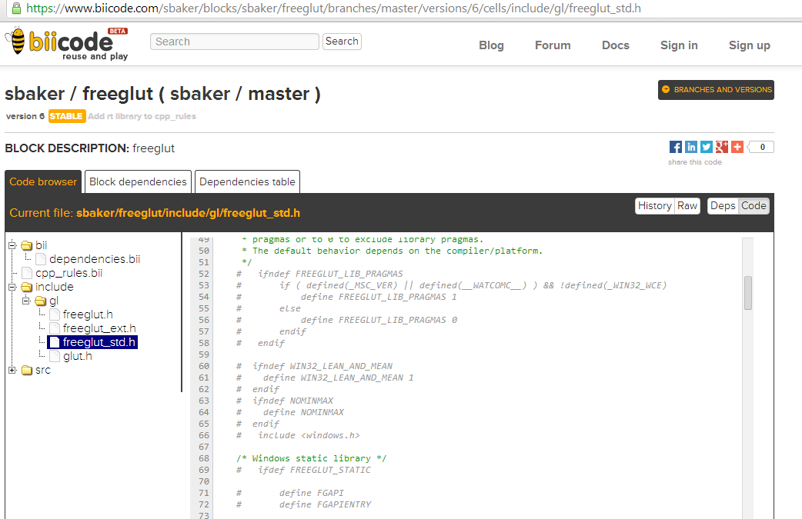

.. _hello_world:

"Hello World!" in C++
=====================

This example shows how to build a simple "Hello World" application with biicode.

Create a new hive
----------------------

Creating a new hive is as easy as executing the ``bii new`` command. Open your console, move to your biicode workspace and create a new hive named **"hello"** (some ouput informative messages are omitted):

.. code-block:: bash

   $ bii new cpp_hello_hive

The system will prompt you for your hive initial programming language, you can select among several options.
Select ``cpp`` here.

It will also prompt for your first block name. A block is a working unit you can publish and navigate in the web.
You can have more than one block in your hives, but now lets start with just one. Enter a descriptive name,
something that summarizes the functionality of all the files that will be in that block. Enter ``cpp_hello``.

Later, it will prompt to generate a default hello world, i.e. a code file with a main() function.
You can press ENTER to accept the default option here: ``yes``.

Last, you will be asked to select an IDE family (``None`` by default) and a build type (``Debug`` by default). You can press ENTER again to accept the default options.

.. code-block:: bash

   Select language: (java/node/fortran/python/cpp/arduino/None)
   Introduce lang (default:None): arduino
   How would you like to name your first block?
   Introduce block name: cpp_hello
   Generate a default hello world?  (YES/no) [ENTER]
   Select IDE family: (Visual/CodeBlocks/Eclipse/NetBeans/None)
   Introduce ide (default:None): [ENTER]
   Select build type: (None/Debug/Release/RelWithDebInfo/MinSizeRel)
   Introduce build_type (default:Debug): [ENTER]

   
This command will create the following layout:

.. code-block:: text

   |-- arduino_blink_hive
   |    +-- bin
   |    +-- blocks
   |    |     +-- your_user_name
   |    |    |     +-- cpp_hello
   |    |    |     |       +-- main.cpp
   |    +-- build
   |    +-- cmake
   |    +-- deps
  

You can open the file **main.cpp** in your favorite editor. It has the code bellow.

.. literalinclude:: ../_static/code/cpp/hello-world/default-main.cpp
   :language: cpp

   
Build and run
----------------

Now, you can build your main file and run it to your Arduino with the command ``cpp:run``.
If you only want to build your main file, just use ``cpp:build``.

.. code-block:: bash

   $ cd cpp_hello_hive
   $ bii cpp:run
   ...
   Hello world!

**That's it!** Your console should show ``Hello world!`` message. You can try more complex outputs!

Creating reusable code
----------------------

It would be interesting to create an example which can be resused by you or other users . So replace the example before with the next files:

**hello.h**

.. literalinclude:: ../_static/code/cpp/hello-world/hello.h
   :language: cpp

**hello.cpp**

.. literalinclude:: ../_static/code/cpp/hello-world/hello.cpp
   :language: cpp

**main.cpp**

.. literalinclude:: ../_static/code/cpp/hello-world/main.cpp
   :language: cpp

You can download these files here: :download:`hello.zip <../_static/code/cpp/hello-world/hello.zip>`

Run the new version to verify that it works ok!
	

Publish your code
-------------------

Once your have written, compiled and successfully executed some code, surely you are willing to share it with the biicode community! Uploading your code to biicode is really simple using the ``bii publish`` command. You will be requested to provide a **tag** and a **message**. Valid tags are ``STABLE``, ``ALPHA``, ``BETA``, and ``DEV``. They provide information about the development state of your hive. The message is any information describing your publication.

.. code-block:: bash

   $ bii publish                                                            

   block:   your_user_name/cpp_hello
   Introduce tag: STABLE                                                           
   Introduce msg: My first hello world project with biicode                            
   
   INFO: Successfully published your_user_name/cpp_hello(your_user_name/master): 0

If your code has been published correctly —as it is the case in the previous example—, you can navigate it here: ``www.biicode.com/user_name``

Here is an example of sbaker's user:

And this is his block's view:

Reuse it!
----------

One of the most interesting aspects of biicode is the ability it provides to easily reuse code. As the published files have already been uploaded to biicode servers, it is possible for anyone —even other biicode users— to use these files in new projects. We'll show the process creating a new hive named **"hellopretty"**. From your biicode workspace folder, execute again the ``bii new`` command to create a new hive:

.. code-block:: bash

   $ bii new cpp_hello_pretty_hive

Now you have to configure this hive as before, except the block name, it will be named ``cpp_hellopretty``.

Add the following files to the folder ``cpp_hello_pretty_hive/blocks/your_user_name/cpp_hellopretty/`` (remember to substitute ``your_user_name`` with your actual biicode user name):

**hellopretty.h**

.. literalinclude:: ../_static/code/cpp/hello-world/hellopretty.h
   :language: cpp

**hellopretty.cpp**

.. literalinclude:: ../_static/code/cpp/hello-world/hellopretty.cpp
   :language: cpp
   :emphasize-lines: 1, 9

**mainpretty.cpp**

.. literalinclude:: ../_static/code/cpp/hello-world/mainpretty.cpp
   :language: cpp

You can download these files here: :download:`hello-pretty.zip <../_static/code/cpp/hello-world/hello-pretty.zip>`

In this case we are using of the ``hello()`` function, which is not explicitly defined in the current hive. If you tried to compile and run this program using the ``bii cpp:run`` command, you would see an error message:

.. code-block:: bash

   $ cd cpp_hello_pretty_hive
   $ bii cpp:run
   ...
   ... : No such file or directory
   #include "your_user_name/cpp_hello/hello.h" //reusing hello.h header
                                                                      ^

However, biicode knows that you are trying to reuse the ``hello.h`` header. To resolve the missing dependencies we use the ``bii find`` command. Hopefully the server will find the dependencies, and you will see a success message on your screen:

.. code-block:: bash

   $ bii find
	
This is a successful ouput that indicates biicode has been able to resolve your dependencies. All needed files have been automatically downloaded and copied to your hive.

Now you can try to compile and run again your new code. In this case the process will succeed:

.. code-block:: bash

   $ bii cpp:run
   ...
   **********************************
   Hello world!
   **********************************

You will find the ``your_user_name/cpp_hello`` block along with the retrieved source files ``hello.h`` and ``hello.cpp`` in your  ``hellopretty/deps`` subfolder. Note that the ``main.cpp`` file of the **hello** block was not retrieved. That is because you don't need it to reuse the ``hello()`` function!

