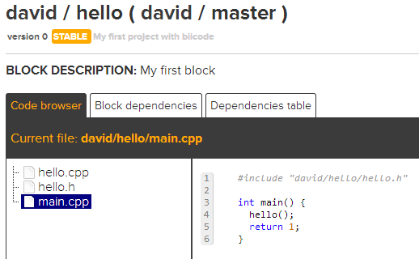

.. _hello_world:

"Hello World!" in C++
=====================

This example shows how to build a simple *'Hello World'* application with biicode.

1. Create a new hive
--------------------

Creating a new hive is as easy as executing the ``bii new`` command. Open your console, move to your biicode workspace and create a new hive named ``cpp_hello_hive`` (some ouput informative messages are omitted):

.. code-block:: bash

   $ bii new cpp_hello_hive

The system will prompt you for your hive initial programming language, you can select among several options.
Select ``cpp`` here.

It will also prompt for **your first block name**. A block is a working unit you can publish and navigate in the web.
You can have more than one block in your hives, but now lets start with just one. Enter a descriptive name,
something that summarizes the functionality of all the files that will be in that block. Enter ``cpp_hello``.

Later, it will prompt to **generate a default hello world**, i.e. a code file with a ``main()`` function. You can press ENTER to accept the default option here: ``yes``.

Last, you will be asked to select an IDE family (``None`` by default) and a build type (``Debug`` by default). You can press ENTER again to accept the default options.

.. code-block:: bash

   Select language: (java/node/fortran/python/cpp/arduino/None)
   Introduce lang (default:None): arduino
   How would you like to name your first block?
   Introduce block name: cpp_hello
   Generate a default hello world?  (YES/no) [ENTER]
   Select IDE family: (Visual/CodeBlocks/Eclipse/NetBeans/None)
   Introduce ide (default:None): [ENTER]
   Select build type: (None/Debug/Release/RelWithDebInfo/MinSizeRel)
   Introduce build_type (default:Debug): [ENTER]

   
This command will create the following layout:

.. code-block:: text

   |-- cpp_hello_hive
   |    +-- bin
   |    +-- blocks
   |    |     +-- your_user_name
   |    |    |     +-- cpp_hello
   |    |    |     |       +-- main.cpp
   |    +-- build
   |    +-- cmake
   |    +-- deps
  

You can open the ``main.cpp`` file in your favorite editor. This file contains the code shown bellow.

.. literalinclude:: ../_static/code/cpp/hello-world/default-main.cpp
   :language: cpp

2. Build and run
----------------

Now, you can build your main file and run it with the ``bii cpp:run`` command. If you only want to build it, just use ``bii cpp:build``.

.. code-block:: bash

   $ cd cpp_hello_hive
   $ bii cpp:run
   ...
   Hello world!

**That's it!** Your console should display now a ``Hello world!`` message. You can try changing the ouput message!

3. Creating reusable code
-------------------------

It would be interesting to create an example which can be reused by you or by other biicode users. Just replace the example before with the next code:

**hello.h**

.. literalinclude:: ../_static/code/cpp/hello-world/hello.h
   :language: cpp

**hello.cpp**

.. literalinclude:: ../_static/code/cpp/hello-world/hello.cpp
   :language: cpp

**main.cpp**

.. literalinclude:: ../_static/code/cpp/hello-world/main.cpp
   :language: cpp

You can download these files here: :download:`hello.zip <../_static/code/cpp/hello-world/hello.zip>`, unzip and copy them into your ``cpp_hello`` block folder. Run the new program to verify that it works as expected!

4. Publish your code
--------------------

Once your have written, compiled and successfully executed some code, surely you are willing to share it with the biicode community! **Uploading your code to biicode** is really simple using the ``bii publish`` command. You will be requested to provide a **tag** and a **message**. Valid tags are ``STABLE``, ``ALPHA``, ``BETA``, and ``DEV``, providing information about the development state of your hive. The message must convey some information about your new publication, and the features it contains.

.. code-block:: bash

   $ bii publish                                                            

   block:   your_user_name/cpp_hello
   Introduce tag: STABLE                                                           
   Introduce msg: My first hello world project with biicode                            
   
   INFO: Successfully published your_user_name/cpp_hello(your_user_name/master): 0

If your code has been published correctly —as it is the case in the previous example—, you can already browse its conents online, on the biicode web site, visiting the url: ``www.biicode.com/your_user_name``. You can see `an example of a published block following this link <https://www.biicode.com/david/blocks/david/hello/branches/master>`_. In this example the biicode user ``david`` has pusblished a block named ``hello``. You acn browse online the block contents and files, and inspect all branches and versions for this block.

5. Reuse it!
------------

One of the most interesting aspects of biicode is the ability it provides to easily reuse code. As the published files have already been uploaded to biicode servers, it is possible for anyone —even other biicode users— to use these files in new projects. We'll show the process creating a new hive named ``cpp_hellopretty_hive``. From your biicode workspace folder, execute again the ``bii new`` command to create a new hive:

.. code-block:: bash

   $ bii new cpp_hellopretty_hive

Now you should configure this hive as you did before, but in this case **the initial block must have a different name**: ``cpp_hellopretty``, for example.

Add the following files to the folder ``cpp_hellopretty_hive/blocks/your_user_name/cpp_hellopretty/`` (remember to substitute ``your_user_name`` with your actual biicode user name):

**hellopretty.h**

.. literalinclude:: ../_static/code/cpp/hello-world/hellopretty.h
   :language: cpp

**hellopretty.cpp**

.. literalinclude:: ../_static/code/cpp/hello-world/hellopretty.cpp
   :language: cpp
   :emphasize-lines: 1, 9

**mainpretty.cpp**

.. literalinclude:: ../_static/code/cpp/hello-world/mainpretty.cpp
   :language: cpp

You can also download these files here: :download:`hello-pretty.zip <../_static/code/cpp/hello-world/hello-pretty.zip>`. Unzip and copy them into your block's folder.

In this case we are using of the ``hello()`` function, which is not explicitly defined in the current hive. If you tried to compile and run this program from your new hive's path using the ``bii cpp:run`` command, you would see an error message:

.. code-block:: bash

   $ bii cpp:run
   ...
   ... : No such file or directory
   #include "your_user_name/cpp_hello/hello.h" //reusing hello.h header
                                                                      ^

However, biicode knows that you are trying to reuse the ``hello.h`` header contained in the ``cpp_hello`` block. To resolve the missing dependencies we use the ``bii find`` command. Hopefully the server will find the dependencies, and you will see a success message on your screen:

.. code-block:: bash

   $ bii find
	
This is a successful ouput that indicates biicode has been able to resolve your dependencies. All needed files have been automatically downloaded and copied to your hive.

Now you can try to compile and run again your new code. In this case the process will succeed:

.. code-block:: bash

   $ bii cpp:run
   ...
   **********************************
   Hello world!
   **********************************

You will find the ``your_user_name/cpp_hello`` block along with the retrieved source files ``hello.h`` and ``hello.cpp`` in your ``cpp_hellopretty_hive/deps`` subfolder. Note that the ``main.cpp`` file of the ``cpp_hello`` block was not retrieved. That is because you don't need it to reuse the ``hello()`` function!

6. Publish a new version of your hello block
--------------------------------------------

Modifying your code and publishing the results is easy with biicode. Now we'll change the message displayed by the ``hello()`` function in the ``username/cpp_hello`` block. Update the ``hello.cpp`` as follows:

**hello.cpp**

.. code-block:: cpp
   :emphasize-lines: 6

   #include "hello.h"
   #include  <iostream>
   using namespace std;

   void hello(){
    cout << "---- Hello biicode! ----" << endl;
   }
   
Execute your block, to make sure everything works as expected:

.. code-block:: bash

   $ cd cpp_hello_hive
   $ bii cpp:run
   ...      
   ---- Hello biicode! ----

Now, post your block to the biicode server just like you did before. From your hive folder:

.. code-block:: bash

   $ bii publish
   block:     username/cpp_hello
   Introduce tag: STABLE
   Introduce msg: My first hello block update
   ...
   Successfully published username/cpp_hello(username/master): 1

As you can see, the version of your block changed from 0 to 1. Your can see both versions published online visiting your biicode user main page, as before.

7. Update your cpp_hellopretty block with the modifications
-----------------------------------------------------------

To update your ``username/cpp_hellopretty`` block with the new modifications to the ``hello()`` function, **you only need to search the server for any published new versions of your dependencies** using the ``bii find`` command and the ``--update`` modifier. If the server finds new published versions for any of your dependencies, you'll see an indicative message on your screen:

.. code-block:: bash

   $ cd cpp_hellopretty_hive
   $ bii find --update
   ...

Finally, you can test the updated code running:

.. code-block:: bash

   $ bii cpp:run
   ...
   **********************************
   ---- Hello biicode! ----
   **********************************

**Now you might be interested in:**

   - If something went wrong, you might want to `find some help in the forum <http://forum.biicode.com/category/c-c>`_, and open a new topic if necessary.
   - Seeing :ref:`more C/C++ examples <cpp_examples>`.
   - I don't want to publish my block, as it doesn't work yet, but I want to save my hive for continuing later in a different computer. :ref:`Read here to check how <hive_usage>`.
   - Specific :ref:`C/C++ commands list <bii_cpp_tools>`
