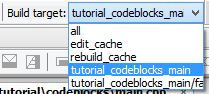

============
Using an IDE
============

Biicode is integrated with mainly used IDEs. You can configure your
projects using your favourite ide with biicode easily.
Follow next instructions to achieve this integration.

Configure your project
======================
First of all, you need to configure your project. If you did it when creating the workspace or hive you can skip this part.

Initialize your default C++ settings writting: ::

	$ bii cpp:settings
	...
	These are your default settings for this Hive
	Builder: MINGW
	Compiler: MINGW

	If you want to change it, you have to modify this file:

	 ./hive_name/bii/settings.bii

Inside the bii  folder of you hive, change the file settings.bii: ::

	cpp:
		builder: {family: MINGW}
		compiler: {family: MINGW}
	os: {arch: 32bit, family: Windows, subfamily: '8', version: 6.2.9200}

includes the following lines: ::

	cpp:
		builder: {family: MINGW}
		compiler: {family: MINGW}
		ide: {family: ECLIPSE, subfamily: CDT}
		build_type: debug
	os: {arch: 32bit, family: Windows, subfamily: '8', version: 6.2.9200}

You can see Visual options in Visual section below.

Eclipse
=======
You can now import your project to Eclipse. The first step is to import the project:

#. File > import...
#. general > Existing Projects into Workspace and clic next.
#. Select root directory:  find the build folder of your hive and click accept.
#. Into the projects box, you should see a project already selected. Click finish

If you want to add any file, just click right mouse button on the folder on your block and create a new file

Note: If you add new dependencies to your project you'll need to manually invoke "bii find"

You can build your application in Project > Build project if you don't have automated builds set.

If you are using **mac** you will need some aditional setup:

#. Right click on your project and select Properties
#. Select "C/C++ Make project" and click "Binary Parser" tab
#. Unselect Mach-O Parser (deprecated)
#. Select Mach-O 64 Parser
#. Click OK

And this is all you need to work as usual in eclipse.

Microsoft Visual Studio
=======================

First of all, you need to inicialize your default C++ settings with the following command: ::

	$ bii cpp:settings
	...
	These are your default settings for this Hive

	Builder: MINGW
	Compiler: MINGW

	If you want to change it, you have to modify this file:

	  ./hive_name/bii/settings.bii

The settings.bii is a YAML file which contains: ::

	cpp:
	  builder: {family: MINGW}
	  compiler: {family: MINGW}
	os: {arch: 32bit, family: Windows, subfamily: '7', version: 6.1.7601}

If you want change your IDE to build your project with Visual Studio you should add the following command line. Copy the line exactly as it appears on screen (same indentation and blank spaces). Note that builder and compiler definition lines are not required any more.: ::

	cpp:
	  ide: {family: VISUAL, version: 10.0}
	os: {arch: 32bit, family: Windows, subfamily: '7', version: 6.1.7601}

Now, copy the code from your hello word tutorial into the block folder. You have just chosen Visual Studio 10.0 version as IDE, i.e Visual Studio 2010. If you now configure the project with these settings, the output in the console would be: ::

	$bii cpp:configure

	...

	invoking cmake  -G "Visual Studio 10" -Wno-dev ../blocks
	-- The C compiler identification is MSVC 16.0.40219.1
	-- The CXX compiler identification is MSVC 16.0.40219.1
	-- Check for working C compiler using: Visual Studio 10
	-- Check for working C compiler using: Visual Studio 10 -- works
	-- Detecting C compiler ABI info
	-- Detecting C compiler ABI info - done
	-- Check for working CXX compiler using: Visual Studio 10
	-- Check for working CXX compiler using: Visual Studio 10 -- works
	-- Detecting CXX compiler ABI info
	-- Detecting CXX compiler ABI info - done
	-- Configuring done
	-- Generating done
	-- Build files have been written to: [hive_build_folder]

If you write $ bii cpp:run, you will see the following message: ::

	invoking cmake  -G "Visual Studio 10" -Wno-dev ../blocks
	-- Configuring done
	-- Generating done
	-- Build files have been written to: [hive_build_folder]
	[!] You have configured an IDE setup
	[!] Use VISUAL to build your project
	[!] Use VISUAL to run your project

Note: when you define any other IDE type, you have to compile and execute from the new IDE, as indicated in the last two lines of the output console.

Finally, you are now ready to open your project with Visual Studio. Just double-click on the .sln file inside the build folder of your hive and a VS project will open with the folder structure that appears below. Your source code is located in the third folder:

.. image:: _static/img/visual_studio_tree.jpg

CodeBlocks
==========

First of all, you need to configure your project. Initialize your default C++ settings writting: ::

	$ bii cpp:settings
	...
	These are your default settings for this Hive
	Builder: MINGW
	Compiler: MINGW

	If you want to change it, you have to modify this file:

	 ./hive_name/bii/settings.bii

Inside the bii  folder of you hive, change the file settings.bii: ::

	cpp:
		builder: {family: MINGW}
		compiler: {family: MINGW}
	os: {arch: 32bit, family: Windows, subfamily: '8', version: 6.2.9200}

includes the following lines: ::

	cpp:
		builder: {family: MINGW}
		compiler: {family: MINGW}
		ide: {family: CodeBlocks}
		build_type: debug
	os: {arch: 32bit, family: Windows, subfamily: '8', version: 6.2.9200}

Now, copy the code from your hello word tutorial into the block folder and write.Now, if you configure the project with these settings, the output in the console would be: ::

	$ bii cpp:configure

	...

	invoking cmake -D CMAKE_BUILD_TYPE=Debug -G "CodeBlocks - MinGW Makefiles" -Wno-dev ../blocks
	-- The C compiler identification is GNU 4.6.2
	-- The CXX compiler identification is GNU 4.6.2
	-- Could not determine Eclipse version, assuming at least 3.6 (Helios). Adjust CMAKE_ECLIPSE_VERSION if this is wrong.
	-- Check for working C compiler: C:/MinGW/bin/gcc.exe
	-- Check for working C compiler: C:/MinGW/bin/gcc.exe -- works
	-- Detecting C compiler ABI info
	-- Detecting C compiler ABI info - done
	-- Check for working CXX compiler: C:/MinGW/bin/g++.exe
	-- Check for working CXX compiler: C:/MinGW/bin/g++.exe -- works
	-- Detecting CXX compiler ABI info
	-- Detecting CXX compiler ABI info - done
	-- Configuring done
	-- Generating done
	-- Build files have been written to: [hive_build_folder]

if you write ``$ bii cpp:run``, you will see the following message: ::

	invoking cmake -D CMAKE_BUILD_TYPE=Debug -G "CodeBlocks - MinGW Makefiles" -Wno-dev ../blocks
	-- Could not determine Eclipse version, assuming at least 3.6 (Helios). Adjust CMAKE_ECLIPSE_VERSION if this is wrong.
	-- Configuring done
	-- Generating done
	-- Build files have been written to: [hive_build_folder]

	[!] You have configured an IDE setup
	[!] Use CODEBLOCKS to build your project
	[!] Binary file does not exist

Note: when you define other IDE type, you have to compile and execute with this new one as indicated in the last two lines of the output console.

Finally, you are ready to open your project with CodeBlocks. The first step is to open the project:

#. File > open...
#. find the build folder of your hive and click on **[Hive_name].cbd**
#. Click open

Now you have your project in eclipse workspace with a following folder tree like this:

.. image:: _static/img/codeblocks_tree.png

For this tutorial our user name is tutorial and our block name is codeblocks.

If you want to add any file, just click on `File > New > Empty file` and create a new file in the `blocks/user/block` folder.

To runs your project you need to select the main file on build target:

And this is all you need to work as usual in CodeBlocks.
