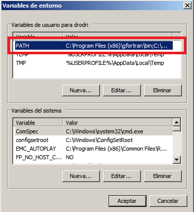

.. _cpp_desktop_win:

C++ Windows
===========

* `MinGW, the minimalist GNU for Windows <http://www.mingw.org/>`_. This project provides an Open Source minimalist development environment for native Microsoft Windows applications. Follow `this link <http://sourceforge.net/projects/mingw/files/Installer/>`_ to get the installer, and choose while installing two additional packages, GCC and G++ package.
* `CMake, an Open Source tool that manages the software building process in a compiler-independent manner <http://www.cmake.org/>`_. You can `download the latest version of CMake from this location <http://www.cmake.org/cmake/resources/software.html>`_.

**Note**: After installing the tools, you must add the binary folder directions in your Windows ``PATH Environment`` (in **My Computer**, click **Properties**, click **Advanced System Settings** and in the System Properties window click the **Environment Variables** button, then you will see a new window and in **System Variables** you'll find the variable ``PATH``), for example:

  * ``C:/MinGW/bin``
  * ``C:/Program Files/CMake/bin``

