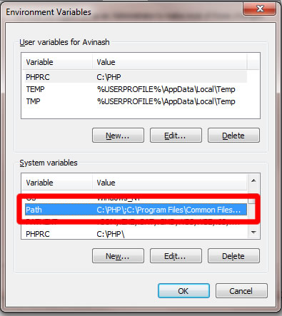

.. _installation:

Installation and setup
======================

In this section you will learn how to download the biicode client and install it on your system.

.. contents::
	:local:

Download and install the client binaries
----------------------------------------

First of all, download the appropriate client binaries for your system, execute the setup program and follow the instructions.

0.7.2
^^^^^

**Download 0.7**

* `ubuntu32 <https://s3.amazonaws.com/biibinaries/release/0.7.2/bii-ubuntu32_0_7_2.deb>`_
* `ubuntu64 <https://s3.amazonaws.com/biibinaries/release/0.7.2/bii-ubuntu64_0_7_2.deb>`_
* `win <https://s3.amazonaws.com/biibinaries/release/0.7.2/bii-win_0_7_2.exe>`_
* `mac64 <https://s3.amazonaws.com/biibinaries/release/0.7.2/bii-macos64_0_7_2.pkg>`_
* `raspbian <https://s3.amazonaws.com/biibinaries/release/0.7.2/bii-rpi_0_7_2.deb>`_

.. raw:: html

	Here is the <a class="modal" href="changelog.html" title="biicode Changelog">Changelog</a>.
	

0.6.2
^^^^^^
**Important note users upgrading from previous versions to 0.6**: in this version  :ref:`policies configuration file <policies>` has changed so you'll need to re-add your custom policies

0.6.2
^^^^^^
**Important note users upgrading from previous versions to 0.6**: in this version  :ref:`policies configuration file <policies>` has changed so you'll need to re-add your custom policies

0.5
^^^^^^

**Important note users upgrading from previous versions to 0.3.4**: in this 0.3.4 version the :ref:`hive layout <hive_layout>` has changed so you need to follow next steps to upgrade it:

* rename YOUR_HIVE/src to YOUR_HIVE/blocks
* rename YOUR_HIVE/dep to YOUR_HIVE/deps
* delete YOUR_HIVE/blocks/CMakeLists.txt
* delete YOUR_HIVE/build
* execute ``bii:clean``
* execute ``bii cpp:configure``

Install the development tools
-----------------------------
.. _dev_tools_installation:

Now, you need to install some development tools in your machine.

Linux
^^^^^

**C++**: Install the required development tools as root:

.. code-block:: bash

	$ sudo apt-get install build-essential cmake
        $ sudo dpkg -i bii-ubuntu{ARCH}_{VERSION}.deb

Windows
^^^^^^^

**C++**: You need to install the following elements:

* `MinGW, the minimalist GNU for Windows <http://www.mingw.org/>`_. This project provides an Open Source minimalist development environment for native Microsoft Windows applications. Follow `this link <http://sourceforge.net/projects/mingw/files/Installer/>`_ to get the installer, and choose while installing two additional packages, GCC and G++ package.
* `CMake, an Open Source tool that manages the software building process in a compiler-independent manner <http://www.cmake.org/>`_. You can `download the latest version of CMake from this location <http://www.cmake.org/cmake/resources/software.html>`_.

**Note**: After installing the tools, you must add the binary folder directions in your Windows ``PATH Environment`` (in **My Computer**, click **Properties**, click **Advanced System Settings** and in the System Properties window click the **Environment Variables** button, then you will see a new window and in **System Variables** you'll find the variable ``PATH``), for example:

  * ``C:/MinGW/bin``
  * ``C:/Program Files/CMake/bin``

Mac OS X
^^^^^^^^

**C++**: You need to install:

* The XCode Developeer Tools

.. code-block:: bash

	$ xcode-select --install

* The appropriate `version of CMake <http://www.cmake.org/cmake/resources/software.html>`_ for your Mac OSX.

.. _upgrading:

Upgrading
---------

Upgrades of biicode are straightforward:
download the new package, install it over the existing package.
The installer will handle the work of removing old files.
