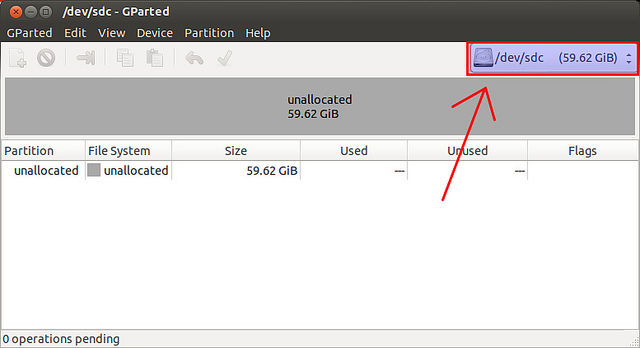
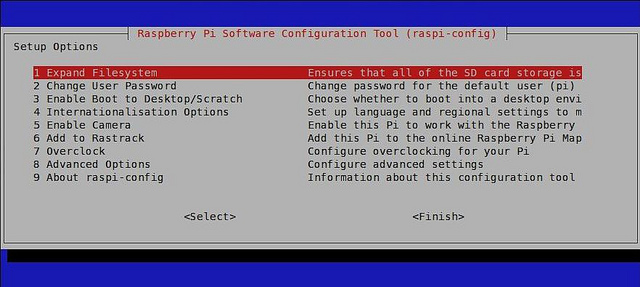
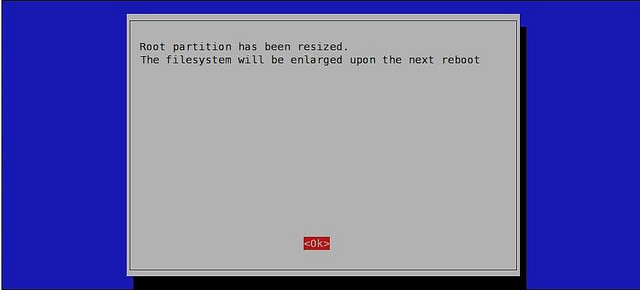
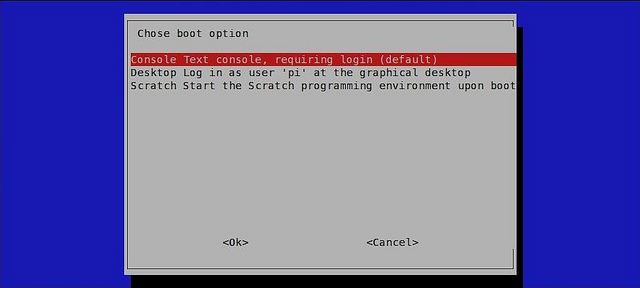
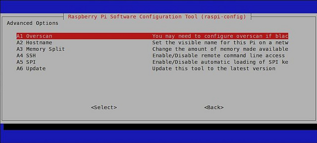

Raspberry Pi
============

Raspberry Pi configuration
--------------------------

Following our philosophy of reuse, tutorial about how to burn SD cards and guide on how to configure the Raspberry Pi is a reuse of two articles `Kristophorus Hadiono <http://xmodulo.com/author/kristophorus>`_.

* `How to write Raspberry Pi image to SD card <http://xmodulo.com/2013/11/write-raspberry-pi-image-sd-card.html>`_
* `How to configure Raspberry Pi for the first time <http://xmodulo.com/2013/11/configure-raspberry-pi-first-time.html>`_

Download and install
^^^^^^^^^^^^^^^^^^^^

Raspberry Pi uses an SD card as backing storage for an operating system and other tools. In this tutorial, I will describe how to write a Raspberry Pi image to an SD card.

Raspberry Pi images
~~~~~~~~~~~~~~~~~~~

There are several flavors of raw Raspberry Pi images (e.g., Raspbian, Pidora, Risc OS, RaspBMC, Arch, and OpenElec) which you can download from `Raspberry Pi's official site <http://www.raspberrypi.org/downloads>`_. All these images are compatible with both model A and B.
We recommend  to use Raspbian image which based on Debian.

+----------------------------------------+--------------+----------------------------------------+
|                                        |Image         |`2013-09-25-wheezy-raspbian.zip`_       |          
|                                        +--------------+----------------------------------------+
|.. image:: _static/img/rpi/raspbian.png |SHA-1 Checksum|99e6b5e6b8cfbf66e34437a74022fcf9744ccb1d|
|                                        +--------------+----------------------------------------+                       
|                                        |Default login |user: pi password: raspberry            |
|                                        |              +----------------------------------------+
|                                        |              |password: raspberry                     |
+----------------------------------------+--------------+----------------------------------------+
.. _2013-09-25-wheezy-raspbian.zip: http://downloads.raspberrypi.org/raspbian_latest

**Prepare for Burning Raspbian Image to an SD Card**

To burn a Raspbian image, it is recommended to use a class 10 SD card with minimum 4 GB storage.

Before starting the process, first download the Raspbian. The image comes as a zip file. Unzip the file to extract the Raspbian image file.

Burn Raspbian Image to an SD Card
~~~~~~~~~~~~~~~~~~~~~~~~~~~~~~~~~

Linux
~~~~~

Insert your SD card into the card reader.

First, you need to identify the device name for the SD card. For that, you can use Gparted.
 
Launch Gparted, and you will see a drop-down disk selection menu in the top right corner which shows a list of hard drives. In this example, the SD card is mapped to "/dev/sdc". Make a note of this device name as you need it later.

You do not need to create or format any partition on the SD card. If there is already a partition or filesystem created on the SD card, it will be overwritten by dd command subsequently anyway.
If the SD card is mounted, make sure to unmount it now.
Finally, run the following dd command to write Raspberry Pi image to the SD card.

.. code-block:: bash

	$ sudo dd bs=4M if=/path/to/image of=/dev/sdc

The "bs" argument sets the block size to 4 MB. Normally the "bs" argument will work with 4M, but you can change to 1M, which will take longer time to write. The "if" argument sets the full path to Raspbian image, and the "of" argument specifies the device name of the SD card. Here "/dev/sdc" is the device name you identified with Gparted earlier. Note that the dd command will not give you any feedback during its operation, and it will look like freezing. So be patient until writing is finished.

After the writing process is finished, eject the SD card. Plug in to the Raspberry Pi, and make sure that all the connections are ready (HDMI/TV out, keyboard, mouse, Ethernet cable). Finally, turn on the power.

Besides using dd command, you can also try other image writer applications such as `usb-imagerwriter <https://launchpad.net/usb-imagewriter>`_ for deb based distributions, and `imagewriter <http://rpm.pbone.net/index.php3/stat/4/idpl/23633559/dir/redhat_el_6/com/imagewriter-1.10-7.1.el6.x86_64.rpm.html>`_ for rpm based distributions. These tools will make the image writing process more user-friendly than dd command.

Windows
~~~~~~~

First, download and install SD Card Formatter from `SD Associations <https://www.sdcard.org/downloads/formatter_4/eula_windows/>`_.
Insert your SD card into the card reader, and then format the SD card with SD Card Formatter. Formatting options do not matter, as the formatted filesystem will be overwritten during the subsequent image writing step. The reason why we format the SD card is to make the card recognized by the operating system.

.. image:: _static/img/rpi/burn_win_sd.png

Next, download and install `win32diskimager <http://sourceforge.net/projects/win32diskimager/>`_ application which can flash an SD Card.
Launch win32diskimager. After locating the extracted Raspbian raw image via a built-in file dialog box, write the image to an SD card. It will take some times to finish writing the image into the SD card.

.. image:: _static/img/rpi/burn_win_win32diskimager.jpg

After the writing process is finished, eject the SD card and plug in to the Raspberry Pi.

Mac
~~~

First, download and install SD Card Formatter from `SD Associations <https://www.sdcard.org/downloads/formatter_4/eula_mac/>`_.
Insert your SD card into the card reader, select “Overwrite Format” and then format the SD card with SD Card Formatter.  The reason why we format the SD card is to make the card recognized by the operating system.

.. image:: _static/img/rpi/burn_win_sd.png

Finally, run the following dd command to write Raspberry Pi image to the SD card.

.. code-block:: bash

	$ sudo dd bs=4M if=/path/to/image of=/dev/sdc

The "bs" argument sets the block size to 4 MB. Normally the "bs" argument will work with 4M, but you can change to 1M, which will take longer time to write. The "if" argument sets the full path to Raspbian image, and the "of" argument specifies the device name of the SD card. Here "/dev/sdc" is the device name you identified with Gparted earlier. Note that the dd command will not give you any feedback during its operation, and it will look like freezing. So be patient until writing is finished.

Configuration
^^^^^^^^^^^^^

After the writing process is finished, eject the SD card. Plug in to the Raspberry Pi, and make sure that all the connections are ready (HDMI/TV out, keyboard, mouse, Ethernet cable). Finally, turn on the power.

After the Raspbian system is installed on an SD card, put the SD card into the Raspberry card reader. Make sure that everything (e.g., external HDMI monitor/TV, keyboard and mouse) is connected properly. Upon the first time booting, you will see the following setup options appear in the screen. This is a Raspberry Pi configuration tool called raspi-config. You can skip this part, and run the tool later if you know what are you doing. However, it is wise to go through the options for the first time setup.

Expanding the File System
~~~~~~~~~~~~~~~~~~~~~~~~~

If you wrote Raspbian image to an SD card with dd command, it normally takes around 3 GB of your SD card space. This means that if you have 4 GB or more in your SD card, the default Raspbian system will not recognize all available SD card space. Then how can you use the remaining space, or in other words, how can you “expand” the Raspbian file system, so that it recognizes the entire SD card space?

This is when "Expand Filesystem" menu option can help. Click the option, which will then guide you to expand a root partition with fdisk as shown below.

.. image:: _static/img/rpi/shell_expanding.jpg

The resulting partition layout change will take effect after rebooting Raspberry Pi.

Enable Boot to Desktop / Scratch
~~~~~~~~~~~~~~~~~~~~~~~~~~~~~~~~

The menu option called “Enable Boot to Desktop” in raspi-config allows you to automatically launch and log in to the GUI desktop of Raspbian upon booting. You can also enable the Scratch programming environment. By default, Raspbian is set to boot into a text-based console log in. Depending on your use case, enable booting to desktop.

Advanced Options
~~~~~~~~~~~~~~~~

In the "Advanced Options" menu, you can manage several important options for Raspberry Pi. Under this menu, you will see several advanced options like below. The "Overscan" option is useful when you set up an external HDMI monitor or TV properly. The default value is enabled, but to make sure, choose "Enable" button again inside the Overscan menu.

If you want to change the host name of your Raspberry Pi, choose "Hostname" option, and then type the name that you will use as host name. The default value of host name is "raspberry".
Finally, do not forget to activate SSH service in Raspberry Pi by choosing the SSH menu and entering "Enable" button. The SSH service is needed when you want to run Raspberry Pi headless.

Once you are done with configuration, finish raspi-config, and reboot Raspberry Pi.
The following screenshot shows the Raspbian GUI desktop with default login (user name: "pi", and password: "raspberry").

Setup linux for cross compiling 
-------------------------------

To use the cross compilers that are in the raspberry pi githab repository need to have the Linux OS installed or a virtual machine that contains it.
We recommend using ubuntu,but any debian distribution should work perfectly.
Now let's look all the tools we need to install to use the Raspberry Pi with biicode.

Install and download some tools
^^^^^^^^^^^^^^^^^^^^^^^^^^^^^^^

First, if you have 64-bit OS, you need to install the support for 32 bit applications. These libraries are required to use the cross compilers supplied Raspberry Pi from its repository on github.

.. code-block:: bash

	$ sudo apt-get install ia32-libs
	
If it finds no the package, you may need to add a package:

.. code-block:: bash

	$ sudo dpkg --add-architecture i386
	$ sudo apt-get update
	$ sudo apt-get install ia32-libs

It is possible that you encounter this problem. 
	
.. code-block:: bash
	
	Some packages could not be installed. 
	This may mean that you have requested an impossible situation the following packages have unmet dependencies:
	ia32-libs : Depends: ia32-libs-multiarch

If so, just install the dependencies manually like any other package

.. code-block:: bash

	$ sudo apt-get install ia32-libs-multiarch
	
Now, clone the Raspberry Pi repository with linux cross-compilers from github.

.. code-block:: bash

	$ cd /user/local
	$ sudo git clone https://github.com/raspberrypi/tools.git
	
Finally, it only remains to biicode installed. To do this, you can follow the tutorial that appears in the section of installation and setup.

Configure your workspace
------------------------

Now, add the cross compilers to enviroment.bii, like shown in the last four lines: ::

	cpp:
	  builders:
	    - path: make
	      tool: {family: MAKE}
      compilers:
        - path: null
	      tool: {family: GNU}
	    - path: /user/local/tools/arm-bcm2708/arm-bcm2708hardfp-linux-gnueabi/bin/arm-bcm2708hardfp-linux-gnueabi-gcc
          tool: {family: GNU, subfamily: C, arch: ARM}
	    - path: /user/local/raspberry_pi/tools/arm-bcm2708/arm-bcm2708hardfp-linux-gnueabi/bin/arm-bcm2708hardfp-linux-gnueabi-g++
          tool: {family: GNU, subfamily: CPP, arch: ARM}
	  
Create a new hive and code!
---------------------------

Creating a new hive with the ``bii new`` command.

Copy the code that you want to compile into your ``block folder``. For example:

**hello.h**

.. code-block:: cpp
	:linenos:

	#include  <iostream>
	using namespace std;
	 
	void hello(){
	 cout<<"Hello World"<<endl;
	}

**main.cpp**

.. code-block:: cpp
	:linenos:

	#include "hello.h"
	 
	int main() {
	  hello();
	  return 1;
	}

Compile your code
^^^^^^^^^^^^^^^^^

Once you have completed all the coding process, you are ready to make the cross-compilation:

.. code-block:: bash

	$ bii rpi:build

Note that the ``bii rpi:build`` command needs to be executed from a folder containing a hive like any other biicode project. After some messages showing information about the compiling process, the binaries will created in your ``bin folder``.

Send your binaries
------------------

To send your binary to Raspberry Pi, you just execute the ``rpi:send`` command and the file will be sent by scp to the address that appears in your **settings.bii**:

.. code-block:: bash

	$ bii rpi:send

	...
	
	Sending with scp -r [HIVE_DIRECTORY]/bin [RPI_USER]@[RPI_IP]:[DIRECTORY]/[HIVE_NAME]

	RPI_USER@RPI_IP's password:

Finally, the Raspberry Pi user's password will be asked. If you have not changed your password, for raspbian is **raspberry**.

If you want to send files to another Raspberry Pi or specify a different directory that appears in your settings.bii, you have the option of passing these parameters to the bii:send. These parameters are not obligatory, can be passed only a new directory and use the other parameters of settings.bii.

.. code-block:: bash

	$ bii rpi:send [directory] [user] [ip]
	
	...
	
	$ bii rpi:send [directory]
	
	

You just have to go to your Raspberry Pi and execute the binaries as any computer.
